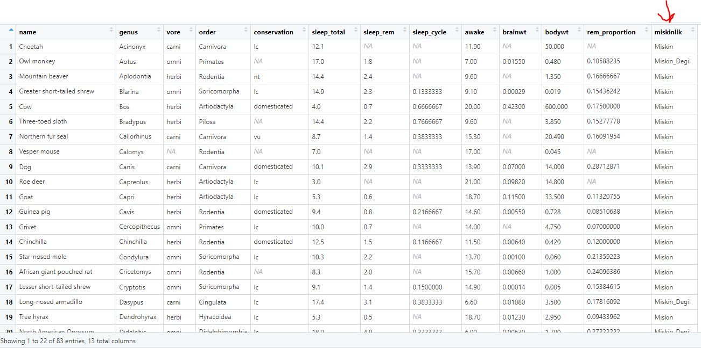

# Lesson 3

## Başlıklar:
* [Giriş](#giriş)
* [Bir veriseti nasıl yüklenir?](#veri-manipülasiyonu)
* [dyplr paketi](#dyplr-fonksiyonları)
* [select()](#select-fonskyionu)
* [filter()](#filter-fonskiyonu)
* [Pipe %>% operatörü](#pipe--fonksiyonu-operatörü)
* mutate()
* [arrange()](#arrange-fonksiyonu)
* transmute()
* summarise()
* group_by()
* count()
* top_n()
* genel egzersiz
* gather()
* spread()
* unite()
* dplyr ile join işlemleri


## Giriş
Bugüne kadar R objelerini nasıl tanımlayabildiğimizi, fonksiyonların ne olduğunu ve nasıl kullanabildiğimizi öğrendik. Kendi slot makinemizi de yazabildik! kolay bir iş değildi elbette.
Böylece R okur yazarlığını büyük bir kısmını öğrenmiş olduk ve artık veri analitiği kısmına yavaşça başlıyor olacağız.

Verisetlerin ne olduğunu biliyor, üzerine basit işlemler gerçekleştirir, soru sorup cevabını mantıksal operatörler kullanarak bulabiliyoruz.
Bugün ise bu işlemleri hızlı bir şekilde yapacağız. R'ın içinde tanımlı olan paketleri kullanarak verimli ve etkin bir şekile veri analitiği ihtiyaçlarımızı çözüyor olacağız.
Haftaya ise görselleştirmeye geçeceğiz, böylece temel R okur yazarlığını bitirmiş olacağız. Sonrasından Veri bilimin temel yöntemlerini R kullanarak yapıyor olacağız.

## Veri Manipülasiyonu
Bu kısımda veriyi içeri aktarma, düzenleme, temizleme, filtreleyerek kesit alma, özet istatistikler çıkartma ve veri setimizle ilgili sorabileceğimiz sorulara cevap vermemizi sağlayacak birtakım araçlar kullanacağız. Bunu ise R'da genel olarak kullanılan "dplyr" paketi fonksiyonları ile yapacağız.
İlk başta "dpylr" kutuphanesini indirelim
```R
install.packages("dplyr")
```

R studio'da bir fonksiyonu indirdiğinizde bir daha indirmenize gerek yok, bilgisayarınızın içinde kalır. Yalnızca kullanmak isterseniz R studio'yu her açtığında çağırmanız lazım .
çağıralım,
```R
library(dplyr)
```

**Soru:** Fonkiyonu indirdim ama bana uyarı geliyor 

**Cevap:** Hatalar (errors) ve uayrılar (warnings) arasındaki farkı bilmemiz lazım,  warning'ler hata olmak zorunda değiller. R studio bize diyor ki "ben böyle böyle yaptım haberin olsun", yani kodu çalıştırdı ama emin olamadığı kısmı bize bilgilendiriyor. 

**Soru:** Ben fonksiyonu çağırdım ama hiç bir şey gelmedi ekrana 

**Cevap:** Ekrana hiç bir şey gelmemek iyidir. bir hata almadığımız zaman kutuphane doğru bir şekilde çağırıldı demek

Kullanacağımız bazı "dplyr" fonksiyonları aşağıdaki gibidir:
filter() ---> Veriyi belli bir kurala göre filtreleyerek veri setinden kesit almamızı sağlar
select() ---> İstediğimiz değişkenleri seçmemizi sağlar
mutate() ---> Veri setimize yeni bir değişken eklememizi sağlar
arrange() ----> Veriyi bir değişkene göre sıralamamızı sağlar
summarise() ---> Veri setinden özet istatistikler çıkarmamızı sağlar

## Bir veriseti nasıl yüklenir ?
Bu bölümü anlatırken msleep (Mammals Sleep) veri setini kullanacağız. Bu veri setini 3 farklı yoldan içeri aktaracağız:

1. CADS@TEDU GitHub [Hesabından](https:\\raw.githubusercontent.com\cads-tedu\DSPG\master\Veri%20Manip%C3%BClasyonu\msleep.csv):

İnternet üzerinden bir veri seti indirmek için "RCurl" kutuphanesinin getURL() fonskiyonunu kullanacağız,
```R
install.packages("RCurl")
library(RCurl)
url <- getURL("https://raw.githubusercontent.com/cads-tedu/DSPG/master/Veri%20Manip%C3%BClasyonu/msleep.csv")
```
**NOT:** link'deki yer alan '\\' (backslash) sembölleri '/' (slash)  ile değiştirmemiz lazım. Aksi halde linki doğru şekilde okuyamaz

```R
msleep <- read.csv(text=url)
head(msleep)
>                         name      genus  vore        order conservation sleep_total sleep_rem sleep_cycle awake brainwt  bodywt
1                    Cheetah   Acinonyx carni    Carnivora           lc        12.1        NA          NA  11.9      NA  50.000
2                 Owl monkey      Aotus  omni     Primates         <NA>        17.0       1.8          NA   7.0 0.01550   0.480
3            Mountain beaver Aplodontia herbi     Rodentia           nt        14.4       2.4          NA   9.6      NA   1.350
4 Greater short-tailed shrew    Blarina  omni Soricomorpha           lc        14.9       2.3   0.1333333   9.1 0.00029   0.019
5                        Cow        Bos herbi Artiodactyla domesticated         4.0       0.7   0.6666667  20.0 0.42300 600.000
6           Three-toed sloth   Bradypus herbi       Pilosa         <NA>        14.4       2.2   0.7666667   9.6      NA   3.850
```
**soru:** CSV nedir ve neden böyle bir şeye ihtiyacımız var?

**cevap:** CSV dosyası comma seperated values demek, excel ve diğer çok şey verileri bu şekilde tutuyor. En az yer kaplayan yöntemlerden bir tanesi. Çok büyük verietin varsa CSV şeklinde tutmayı tercih edersin. Herhangi bir csv dosyası excelde açabilirsin. 

2. Bilgisayardan  

Eğer csv dosyası sizin bilgisayarınızda bulunuyorsa yine read.csv() kullanarak elde edebiliriz
```R
msleep <- read.csv("C:/Users/X/Desktop/msleep.csv") 
head(msleep)

>                         name      genus  vore        order conservation sleep_total sleep_rem sleep_cycle awake brainwt
1                    Cheetah   Acinonyx carni    Carnivora           lc        12.1        NA          NA  11.9      NA
2                 Owl monkey      Aotus  omni     Primates         <NA>        17.0       1.8          NA   7.0 0.01550
3            Mountain beaver Aplodontia herbi     Rodentia           nt        14.4       2.4          NA   9.6      NA
4 Greater short-tailed shrew    Blarina  omni Soricomorpha           lc        14.9       2.3   0.1333333   9.1 0.00029
5                        Cow        Bos herbi Artiodactyla domesticated         4.0       0.7   0.6666667  20.0 0.42300
6           Three-toed sloth   Bradypus herbi       Pilosa         <NA>        14.4       2.2   0.7666667   9.6      NA
   bodywt
1  50.000
2   0.480
3   1.350
4   0.019
5 600.000
6   3.850  
```
3. Excel'den

Eğer dosya excel formatındaysa "readxl" paketinden read_excel() fonksiyonu ile veriyi içeri aktarabiliriz.

 Excel dosyası sheetlerden oluşur. dosyayı açarsak birinci ve ikinci sheetlerin boş olduğunu görebiliriz. bizim istediğimiz veriler "msleep" isimli sheette yer aldığını görüyorüz. Hangi sheetten veri çekmek istediğimizi read_excel fonksiyonuna "sheet" parametresiyle söyleyebiliriz.

```R
install.packages("readxl")
library(readxl)
msleep_1 <- read_excel("C:/X/Undefined/Desktop/msleep_1.xlsx",sheet="msleep")
head(msleep_1)

>                          name      genus  vore        order conservation sleep_total sleep_rem sleep_cycle awake brainwt
1                    Cheetah   Acinonyx carni    Carnivora           lc        12.1        NA          NA  11.9      NA
2                 Owl monkey      Aotus  omni     Primates         <NA>        17.0       1.8          NA   7.0 0.01550
3            Mountain beaver Aplodontia herbi     Rodentia           nt        14.4       2.4          NA   9.6      NA
4 Greater short-tailed shrew    Blarina  omni Soricomorpha           lc        14.9       2.3   0.1333333   9.1 0.00029
5                        Cow        Bos herbi Artiodactyla domesticated         4.0       0.7   0.6666667  20.0 0.42300
6           Three-toed sloth   Bradypus herbi       Pilosa         <NA>        14.4       2.2   0.7666667   9.6      NA
   bodywt
1  50.000
2   0.480
3   1.350
4   0.019
5 600.000
6   3.850
```
Şimdi veri setimizin structure'ına be summery'ne bakalım,
```R
str(msleep)
> 'data.frame':	83 obs. of  11 variables:
    $ name        : Factor w/ 83 levels "African elephant",..: 12 57 52 36 17 77 55 81 21 67 ...
    $ genus       : Factor w/ 77 levels "Acinonyx","Aotus",..: 1 2 3 4 5 6 7 8 9 10 ...
    $ vore        : Factor w/ 4 levels "carni","herbi",..: 1 4 2 4 2 2 1 NA 1 2 ...
    $ order       : Factor w/ 19 levels "Afrosoricida",..: 3 15 17 19 2 14 3 17 3 2 ...
    $ conservation: Factor w/ 6 levels "cd","domesticated",..: 4 NA 5 4 2 NA 6 NA 2 4 ...
    $ sleep_total : num  12.1 17 14.4 14.9 4 14.4 8.7 7 10.1 3 ...
    $ sleep_rem   : num  NA 1.8 2.4 2.3 0.7 2.2 1.4 NA 2.9 NA ...
    $ sleep_cycle : num  NA NA NA 0.133 0.667 ...
    $ awake       : num  11.9 7 9.6 9.1 20 9.6 15.3 17 13.9 21 ...
    $ brainwt     : num  NA 0.0155 NA 0.00029 0.423 NA NA NA 0.07 0.0982 ...
    $ bodywt      : num  50 0.48 1.35 0.019 600 ...


summary()
>                         name             genus         vore             order          conservation  sleep_total      sleep_rem      sleep_cycle    
 African elephant         : 1   Panthera    : 3   carni  :19   Rodentia    :22   cd          : 2    Min.   : 1.90   Min.   :0.100   Min.   :0.1167  
 African giant pouched rat: 1   Spermophilus: 3   herbi  :32   Carnivora   :12   domesticated:10    1st Qu.: 7.85   1st Qu.:0.900   1st Qu.:0.1833  
 African striped mouse    : 1   Equus       : 2   insecti: 5   Primates    :12   en          : 4    Median :10.10   Median :1.500   Median :0.3333  
 Arctic fox               : 1   Vulpes      : 2   omni   :20   Artiodactyla: 6   lc          :27    Mean   :10.43   Mean   :1.875   Mean   :0.4396  
 Arctic ground squirrel   : 1   Acinonyx    : 1   NA's   : 7   Soricomorpha: 5   nt          : 4    3rd Qu.:13.75   3rd Qu.:2.400   3rd Qu.:0.5792  
 Asian elephant           : 1   Aotus       : 1                Cetacea     : 3   vu          : 7    Max.   :19.90   Max.   :6.600   Max.   :1.5000  
 (Other)                  :77   (Other)     :71                (Other)     :23   NA's        :29                    NA's   :22      NA's   :51      
     awake          brainwt            bodywt        
 Min.   : 4.10   Min.   :0.00014   Min.   :   0.005  
 1st Qu.:10.25   1st Qu.:0.00290   1st Qu.:   0.174  
 Median :13.90   Median :0.01240   Median :   1.670  
 Mean   :13.57   Mean   :0.28158   Mean   : 166.136  
 3rd Qu.:16.15   3rd Qu.:0.12550   3rd Qu.:  41.750  
 Max.   :22.10   Max.   :5.71200   Max.   :6654.000  
```

**NOT:** Dataframe'i daha düzgün bir şekilde görmek istiyorsak R studio'nun Environment kısmındaki değişkene tıklayarak düzgün halini görebiliriz.


**soru:** istatistiklere neden bakıyoruz ?

**cevap:** verisetiyi ilk yüklediğinde yaptığın ilk şey onu incelemektir. İçinde ne var ne yok bakıyorsun. Aklında bazı sorular oluşabilir bu aşamada. 

**NOT:** read_csv() ve read_excel() fonksiyonlari Dataframe tipindendir.

Değişkenlerin açıklamalarına bakalım, 

name: isimler

genus: memelinin cinsi

vore: karnivor, omnivor, herbivor

order: taksonomik sıralama

conservation: memelilerin korunma durumu

sleep_total: saat cinsinden toplam uyku süresi

sleep_rem: saat cinsinden rem uykusu süresi

sleep_cycle: saat cinsinden uyku döngüsü süresi

awake: saat cinsinden uyanık kalınan süre

brainwt: kilogram cinsinden beyin ağırlığı

bodywt: kilogram cinsinden vücut ağırlığı

## dyplr fonksiyonları

### select() fonskyionu

Yapacağımız ilk işlem verimizden bir seçme yapmaktır.
select fonksiyonları, içindeki yardımcı fonksiyonlar ile değişkenleri istediğimiz gibi seçip, sıralayabiliriz.
Tanımına bakaım,
```R
?select()
```
İlk argümanı olarak bizim datamız, ardından verilerimizin isimlerini girmemizi sölyüyor.

Örneğin, eğer "vore" ve "brainwt" değişkenlerini görmek istersek
```R
select(msleep, vore, brainwt)
>       vore brainwt
1    carni      NA
2     omni 0.01550
3    herbi      NA
4     omni 0.00029
5    herbi 0.42300
6    herbi      NA
7    carni      NA
8     <NA>      NA
9    carni 0.07000
10   herbi 0.09820
11   herbi 0.11500
        .
        .
72   herbi      NA
73    <NA> 0.00033
74    omni 0.18000
75 insecti 0.02500
76   herbi      NA
77   herbi 0.16900
78    omni 0.00260
79    omni 0.00250
80   carni      NA
81   carni 0.01750
82   carni 0.04450
83   carni 0.05040
```
Gördüğümüz gibi sadece "vore" ve "brainwt" değişkenlerini içeren bir Dataframe döndürdü bize!
```R
class(select(msleep, vore, brainwt))
> "data.frame"
```

select fonksiyonun içinde yardımıcı fonksiyonlar kullanabiliriz. Belli bir özelliklere sahip kolonları seçmek istediğimizde yardımcı olur. Bunlardan birkaç tanesi aşağıdaki gibidir:

* starts_with(): belirlenen bir karakterle başlayan
* ends_with(): belirli bir karakterle biten
* contains(): içinde belli bir karakter geçen
* matches(): regex karakterlerle eşleşen
* num_range(): belli bir numerik aralıktataki değişkenleri çeken
* one_of(): bir karakter vektöründeki karakterlerle eşleşen
* everything(): tüm değişkenleri getirir
* last_col(): son değişkeni getirir

Örneğin: İçinde "or" karakterleri içeren değişkenleri getirelim.
(contains() fonksiyonu yardımıyla yapabiliriz )
```R
select(msleep, contains("or"))

>     vore           order
1    carni       Carnivora
2     omni        Primates
3    herbi        Rodentia
4     omni    Soricomorpha
5    herbi    Artiodactyla
        .
        .

81   carni       Carnivora
82   carni       Carnivora
83   carni       Carnivora
```

"sleep" ile başlayan değişkenleri seçelim, 
```R
select(msleep, starts_with(("sleep")))

>   sleep_total sleep_rem sleep_cycle
1         12.1        NA          NA
2         17.0       1.8          NA
3         14.4       2.4          NA
4         14.9       2.3   0.1333333
5          4.0       0.7   0.6666667
            .
            .
81         6.3       1.3          NA
82        12.5        NA          NA
83         9.8       2.4   0.3500000
```

>**Egzersiz:** "sleep" ile başlayan değişkenleri seçtikten sonra diğer değişkenleri bu değişkenlerden sonra ekleyelim. ve "sleep" adlı bir değişkene atalım.

bunu nasıl yapabiliriz ? everything() fonksiyonunu kullanarak bu işlemi gerçekleştirebiliriz.
Birden fazla select işlemi yapmak istiyorsak virgülle ayırarak yapabiliriz.

```R
sleep <- select(msleep, starts_with(("sleep")) , everything())
sleep
```


Belli bir aralıktaki değişkenleri seçmek istersek, örneğin: "genus"tan "conservation" a kadar olan değişkenleri seçmek istersek şu şekilde gerçekleştirebiliriz

```R
select(msleep, genus:conservation)

>           genus    vore           order conservation
1       Acinonyx   carni       Carnivora           lc
2          Aotus    omni        Primates         <NA>
3     Aplodontia   herbi        Rodentia           nt
4        Blarina    omni    Soricomorpha           lc
5            Bos   herbi    Artiodactyla domesticated
                    .
                    .
81       Genetta   carni       Carnivora         <NA>
82        Vulpes   carni       Carnivora         <NA>
83        Vulpes   carni       Carnivora         <NA>

# 2. yol indeksleme kullanarak : 
#select(msleep, 2:5) 
```

> **Egzersiz:** Sonu "wt" karakteriyle biten değişkenleri getirip bu değişkenlerin ilk 10 satırına bakalım.
```R
wt <- select(msleep, ends_with("wt"))
head(wt,10)

>    brainwt  bodywt
1       NA  50.000
2  0.01550   0.480
3       NA   1.350
4  0.00029   0.019
5  0.42300 600.000
6       NA   3.850
7       NA  20.490
8       NA   0.045
9  0.07000  14.000
10 0.09820  14.800
```

### filter() fonskiyonu
filter() fonksiyonu veri setindeki satırları/gözlemleri istenilen şekilde filtrelemek için kullanılır. 
Ayrıca, sütunlar/değişkenleri ayıklamak için kullanılan select() fonksiyonunun
satırlar/gözlemler için kullanılan halidir diyebiliriz. 

filter() ile sadece seçtiğimiz gözlemlerden oluşan yeni bir data frame oluşturmuş oluruz.

filter() fonksiyonu veri setindeki değişken ismi ile beraber bizden bir mantıksal test ifadesi ister. 

filter() fonksiyonundan tam anlamıyla yararlanmak için eşit “==”, eşit değil “!=”, büyük “>”, küçük “<”, büyük eşit “>=” vb. mantıksal operatörlerin iyi bilinmesi gerekir. Daha detaylı bakmak için ?Comparison yapabiliriz yazıp mantıksal operatörleri hatırlayabiliriz!
```R
?Comparison
```


Örnek: Günlük uyku süresi 16 saatten fazla olan hayvanları hangileridir?

```R
filter(msleep, sleep_total > 16)
```


Gördüğümüz gibi, uyku süresi 16 saatten fazla olan 8 tane hayvan varmış.

Birden fazle filter yapmak istersek yine virgül koyarak filtrelerimizi yapabiliriz.

> **Egzersiz:** Uyanık kalma süreleri ortalama uyanık kalma süresinden büyük eşit olan hayvanlar hangileridir?
```R
filter(msleep, awake >= mean(awake))
```


> **Egzersiz:** Hem toplam uyku süresi 16 saati geçen hem de vücut ağırlığı 1 kilogramin üzerinde olan memelileri filtreleyip çıktıyı inceleyelim
```R
filter(msleep, sleep_total > 16, bodywt>1)

#2.yol : filter(msleep, sleep_total > 16 & bodywt>1)
```


>**Egzersiz:** "Perissodactyla" ve "Cingulata" taksonomik sırasına göre memelileri filreleyelim
Burada "Perissodactyla" **ve** "Cingulata" dediği için **&** operatörünü kullanıp böyle bir hataya düşebiliriz
```R
filter(msleep, order == "Perissodactyla" & order=="Cingulata")
```

Yalnızca bu hayvan aynı zamanda hem "Perissodactyla" hem de "Cingulata" olamlı anlamına geliyor. Dolayısıyla **veya** operatörü kullanmamız lazım.

```R
filter(msleep, order == "Perissodactyla" | order=="Cingulata")

#2.yol: filter(msleep, order %in% c("Perissodactyla" , "Cingulata")) 
```


> **Egzersiz:** Beslenme şekli omnivor("omni") olanları seçip ilk altı satırına bakalım.
```R
head(filter(msleep,vore=="omni"))
```


> **Egzersiz:** Vücut ağırlığı en büyük olan hayvan hangisidir? 

```R
max(msleep$bodywt)
> 6654
```
6654 kilogrammış, acaa bir fil olabilir mi ? hemen bakalım,
```R
filter(msleep, bodywt == max(bodywt))
```

Tahmin ettiğimiz gibi bir filmiş.

### Pipe %>% Fonksiyonu (operatörü)
Türkçe karşılığı olarak zincir fonksiyonu olarak da isimlendirilir. 
Bu fonksiyon soldakinin çıktısını, sağdakine girdi olarak veriyor.

Bu şekilde birden fazla işlem dizinini ifade edebilirsiniz. 
Kodunuzu basitlesteştirmenizi ve işlemlerinizi daha açık bir şekilde görebilmenizi sağlar.  

Pipe fonksiyonu çokça kullanacağız, kodun okunabilirliği açısından da oldukça faydalı bir operatördür.

Nasıl yazıldığına bir bakalım
```R
msleep %>%
    select(name, sleep_total)
```
Böylece "name" ve "sleep_total" değişkenleri seçmiş olduk. Bu elde ettiğimiz dataframe'in ilk altı satırına bakmak istersek arkasına head() fonksiyonu yapıştırırız.
```R
msleep %>%
    select(name, sleep_total) %>%
    head()

>                        name sleep_total
1                    Cheetah        12.1
2                 Owl monkey        17.0
3            Mountain beaver        14.4
4 Greater short-tailed shrew        14.9
5                        Cow         4.0
6           Three-toed sloth        14.4
```

*Eren Hoca: Pipe kullanarak 6-7 satırlık işlemler yazacağız. Size tavsiyem, elde etmek istediğiniz yere kadar satırları işaretleyip çalıştırmanızdır. Böylece kafanız karışmaz*

**Egzersiz:** İsim (name), toplam uyku süresi (sleep_total) ve korunma durumlarını (conservation) seçelim ve korunma durumu “domesticated” olanları filtreleyelim. İlk altı satırına bakalım!

```R
msleep %>%
  select(name, sleep_total, conservation) %>%
  filter(conservation == "domesticated") %>%
  head()

>        name sleep_total conservation
1        Cow         4.0 domesticated
2        Dog        10.1 domesticated
3 Guinea pig         9.4 domesticated
4 Chinchilla        12.5 domesticated
5      Horse         2.9 domesticated
6     Donkey         3.1 domesticated
```

## arrange() fonksiyonu
arrange() fonksiyonu satırları/gözlemleri içeriklerine göre sıralamak için kullanılır. 
Böylece veri setini istenilen kriterde sıralayabilirsiniz.

Örneğin: msleep dataframe'inden vücüt ağırlıklarını küçükten büyüğe sıralayalım
```R
msleep %>%
  arrange(bodywt)
```


Gördüğümüz gibi gözlemleri "bodywt" kolonuna göre küçükten büyüğe sıralamış olduk.
 Eğer sıralamayı büyükten küçüğe yapmak istersek arrange() fonksiyonun içine desc() fonksiyonu yerleştirerek elde edebiliriz.
 ```R
msleep %>%
  arrange(desc(bodywt))
 ```


name kolonunu 'a' dan 'z' ye sıralamak istersek,
```R
msleep %>%
  arrange(name)
```

> **Egzersiz:** Veri setimizden name, genus, vore ve brainwt değişkenleri seçip. Beyin ağırlığı 1'den büyük olanları filtreledikten sonra beyin ağırlığına göre büyükten küçüğe sıralatalım.
```R
msleep %>%
  select(name,genus,vore,brainwt) %>%
  filter(brainwt > 1) %>%
  arrange(desc(brainwt))

>              name     genus  vore brainwt
1 African elephant Loxodonta herbi   5.712
2   Asian elephant   Elephas herbi   4.603
3            Human      Homo  omni   1.320
```

Maksimum beyin ağırlığına sahip canlıyı bulmak isteseydik nasıl yapardık?

sadece bir pipe daha ekleyerek bunu elde edebiliriz,
```R
msleep %>%
  select(name,genus,vore,brainwt) %>%
  filter(brainwt > 1) %>%
  arrange(desc(brainwt)) %>%
  head(1)

>              name     genus  vore brainwt
1 African elephant Loxodonta herbi   5.712


# 2.yol : 
msleep %>%
  select(name,genus,vore,brainwt) %>%
  filter(brainwt > 1) %>%
  arrange(desc(brainwt)) %>%
  filter(brainwr == max(brainwt))
```

## mutate() fonksiyonu
#Mutate fonksiyonu ile veri setimize yeni sütunlar/değişkenler ekleyebiliriz.

Rem uykusunun toplam uyku miktarına oranını bulalım ve rem_proportion adlı yeni bir sütuna atayalım. 

```R
msleep <- msleep %>%
  mutate(rem_proportion = sleep_rem / sleep_total)

msleep
```


```R
#2.yol: geçen hafta görmüştük
msleep$rem_proportion <- msleep$sleep_rem / msleep$sleep_total
```

mutate() fonksiyonunun bir başka özelliği ise ihtiyaç duyulduğunda aynı anda aynı kodun içerisinde birden fazla yeni değişken üretebilmesidir.

İlk örneğe ilaveten, gram cinsinde bodywt sütunu olacak şekilde bodywt_grams adli ikinci bir değer yaratalım.
```R
msleep %>%
  mutate(rem_proportion = sleep_rem / sleep_total,
         bodywt_gram = bodywt * 1000)
```


> **Egzersiz:** msleep veri setine brainwt_grams isimli brainwt değişkeninin 1000'le çarpılmış halini ekleyelim.
Ayrıca, sleep_cycle_ratio isimli sleep_cycle'ı 100 ile çarparak yüzde oran belirtecek şekilde ekleyelim.
Bu işlemlerden sonra msleep_yeni isimli veri setine atayalım.
```R
msleep_yeni <- msleep %>%
  mutate(bodywt_gram = bodywt * 1000,
         sleep_cycle_ratio = sleep_cycle * 100)
msleep_yeni
```


mutate() kullanarak numerik değişkenleri kategorikleştirme işlemleri de gerçekleştirebiliriz. Bunun birkaç yöntemi var, onları görmeden size ifelse() fonksiyonundan bahsetmek istiyorum.

ifelse() fonksiyonunun tanımına bir bakalım,
```R
?ifelse() 
```


Burada bir sınama yapıyoruz(ilk argüman), ve bu sınama doğru çıktıysa ikinci argümanı, yanlış çıktıysa üçüncü argümanı döndürecek bize. örneğin,
```R
ifelse(5 > 4, "doğru", "yanlış")

> "doğru"
```
Peki numerik değişkenleri kategorik değerlere dönüştüme işlemine dönelim, bunun iki yöntemle yapabiliriz;

1. ifelse() yöntemi:

```R
msleep$miskinlik <- ifelse(msleep$sleep_total < 16, "Miskin", "Miskin_Degil")
msleep
```

Yani yeni oluşturduğumuz "mikinlik" kolonuna uyku süresi 16 küçük ise "Miskin", değilse "Miskin_değil" değerleri atayacağız.


2. case_when() yöntemi: 
Diğer bir yöntem ise case_when() yöntemi, bu yöntemde birden fazla sınama yapabiliriz. kullanim şekli şu şekilde,

case_when(ilk sınama ~ sonuç1, 
         ikinci sınama ~ sonuç2,
         üçüncü sınama ~ sonuç3 ) 
```R
msleep %>%
  mutate(miskinlik = case_when(sleep_total > 16 ~ "Miskin",
                               sleep_total < 16 ~ "Miskin_Degil"))

msleep %>%
  mutate(uyanıklık = case_when(awake > 4 & awake < 10 ~ "Az_uyanik",
                               awake > 10 & awake < 13 ~ "Ortalama_uyanik",
                               awake > 13 & awake < 16 ~ "Daha_uyanik",
                               awake > 16 ~ "Cok_uyank"))

```


## summarise() fonksiyonu
mutate() fonksiyonu ile dataframe'in sonuna yeni değişkenler ekleyebiliyorduk. Sadece yeni değişkenleri elde etmek istiyorsak transmute() fonksiyonunu kullanabiliriz.

```R
msleep %>% 
  transmute(brainwt_grams = brainwt * 1000,
            sleep_cycle_ratio = sleep_cycle * 1000)

>   brainwt_grams sleep_cycle_ratio
1             NA                NA
2          15.50                NA
3             NA                NA
4           0.29          133.3333
5         423.00          666.6667
```

Gördüğümüz gibi sadece yeni oluşturduğumuz değişkenleri içeren bir dataframe elde ettik.

## summarise() fonksiyonu
Bu fonksiyonla, istatistiksel bir özet olusturulur.

Değişkenler için mod, maksimum, minumum, ortalama, standart sapma vb. hesaplar yapmamızı sağlar.

Canlıların ortalama uyku sürelerini summarise fonksiyonu ile bulalım.
```R
msleep %>%
  summarise(ortalama_uyku = mean(sleep_total))

>   ortalama_uyku
1      10.43373
```
Summarize fonksiyonu içerisinde kullanilabilecek diğer istatistiksel fonksiyonlar vardır. 

Bunlar; sd(), min(), max(), median(), sum(), n(), first(), last() ve n_distinct() vb. fonksiyonlardır.

> **Egzersiz:** Ortalama rem uyku süresini(avg,_rem), en düşük rem uyku süresini (min_rem) ve en yüksek rem uyku sürelerini (max_rem) 
hesaplıyalım ve sırasıyla bu değerlere atayalım. 
İlk altı satıra bakalım.

İpucu: sleep_rem değişkeninde kayıp veriler (NA) olduğundan "mean(), min(), max()" fonksiyonu argümanlarından na.rm=TRUE yapmamız gerekiyor (na.rm gondermedigimiz zaman NA döndürür).

```R
msleep %>% 
  summarise(avg_rem = mean(sleep_rem, na.rm=T), 
            min_rem = min(sleep_rem, na.rm = T),
            max_rem = max(sleep_rem, na.rm= T))

>   avg_rem min_rem max_rem
1 1.87541     0.1     6.6
```

> **Egzersiz:** Canlıların kaç farklı yemek türü yediğini n_distinct() fonksiyonu ile bulup değişkenin ismini çeşit koyalım.
```R
msleep %>%
  summarise(çeşit = n_distinct(vore))

>   çesit
1     5
```

> **Egzersiz:** Canlıların rem uykusunda kalma sürelerinin oranını değişken olarak sleep_rem_ratio ismiyle ekledikten sonra rem uykusunda kalma sürelerinin oranlarının ortalamasını bulalım.
```R
msleep %>% 
  mutate(sleep_rem_ratio = sleep_rem/ sleep_total) %>%
    summarise(avg_ratio = mean(sleep_rem_ratio , na.rm=T))

>   avg_ratio
1 0.1740226
```

## group_by() fonksiyonu
Bu fonksiyon ile istediginiz bir kolona göre gruplama işlemi yapabiliriz. Böylece o grup içerisindeki özet istatistikleri elde edebiliriz.

Örnek üzerine yapalım daha anlaşılır olur. msleep veri setini taksonomik sırasına(order) göre gruplayalım ve yukarıda yaptığımız gibi taksonomik sırasına göre gruplanmış canlıların toplam uyku sürelerinin özet istatistiklerini elde edelim. (n,min, max, sd, mean)
```R
msleep %>%
  group_by(order) %>%
  summarise(toplam = n(),
            ort_sleep = mean(sleep_total),
            min_sleep = min(sleep_total),
            max_sleep = max(sleep_total),
            sd_sleep = sd(sleep_total))

>    order           toplam ort_sleep min_sleep max_sleep sd_sleep
   <fct>            <int>     <dbl>     <dbl>     <dbl>    <dbl>
 1 Afrosoricida         1     15.6       15.6      15.6  NaN    
 2 Artiodactyla         6      4.52       1.9       9.1    2.51 
 3 Carnivora           12     10.1        3.5      15.8    3.50 
 4 Cetacea              3      4.5        2.7       5.6    1.57 
 5 Chiroptera           2     19.8       19.7      19.9    0.141
 6 Cingulata            2     17.8       17.4      18.1    0.495
 7 Didelphimorphia      2     18.7       18        19.4    0.990
 8 Diprotodontia        2     12.4       11.1      13.7    1.84 
 9 Erinaceomorpha       2     10.2       10.1      10.3    0.141
10 Hyracoidea           3      5.67       5.3       6.3    0.551
11 Lagomorpha           1      8.4        8.4       8.4  NaN    
12 Monotremata          1      8.6        8.6       8.6  NaN    
13 Perissodactyla       3      3.47       2.9       4.4    0.814
14 Pilosa               1     14.4       14.4      14.4  NaN    
15 Primates            12     10.5        8        17      2.21 
16 Proboscidea          2      3.6        3.3       3.9    0.424
17 Rodentia            22     12.5        7        16.6    2.81 
18 Scandentia           1      8.9        8.9       8.9  NaN    
19 Soricomorpha         5     11.1        8.4      14.9    2.70 
```

Gördüğümüz gibi, 19 tane taksonomik sıralamamız var. toplam değişkenine atadığımız n() fonskiyonu gözlemlerin sayısını temsil ediyor. verisetimizde 1 tane "Afrosoricida" hayvanı var, onun ortalama uyku süresi 15.6, standart sapması tek bir gözlem olduğu için hesaplayamadık (NAN döndürdü). 

> **Egzersiz:** Canlıları yemek şekillerine (vore) grupladıktan sonra beyin ağırlıklarının özet istatistiklerini çıkaralım. Sonrasında ise ortalama beyin ağırlıklarını büyükten küçüğe sıralayalım.

```R
msleep %>%
  group_by(vore) %>%
  summarise(toplam = n(),
            ort_brainwt = mean(brainwt ,na.rm = T),
            min_brainwt = min(brainwt,na.rm = T),
            max_brainwt= max(brainwt,na.rm = T),
            sd_brainwt = sd(brainwt,na.rm = T)) %>%
  arrange(desc(ort_brainwt))

>  vore    toplam ort_brainwt min_brainwt max_brainwt sd_brainwt
  <fct>    <int>       <dbl>       <dbl>       <dbl>      <dbl>
1 herbi       32     0.622      0.0004         5.71     1.57   
2 omni        20     0.146      0.000140       1.32     0.325  
3 carni       19     0.0793     0.0108         0.325    0.103  
4 insecti      5     0.0216     0.00025        0.081    0.0349 
5 NA           7     0.00763    0.00033        0.021    0.00859
```
## count() fonskiyonu
Kategorik değişkenleri, group_by() ve n() fonksiyonlarını kullanmadan count() fonksiyonu ile sayabilmemizi sağlar. Yani adı üzerine, sayıyor!

Hangi yemek tercihinden kaç tane var? (vore)
```R
msleep %>% 
  count(vore)
>  vore        n
  <fct>   <int>
1 carni      19
2 herbi      32
3 insecti     5
4 omni       20
5 NA          7

#sıralamak istiyorsak sort argümanı TRUE yaparız
msleep %>% 
  count(vore, sort=T)
>  vore        n
  <fct>   <int>
1 herbi      32
2 omni       20
3 carni      19
4 NA          7
5 insecti     5
```

bu neye denk? (neyle yapabiliyorduk)
```R
msleep %>% 
  group_by(vore) %>%
  summarise(n())
```
Peki ya hem yemek tercihlerine göre(vore) hem de korunma sayılarına(conservation) canlıların sayılarını görmek istiyorsak nasıl yapabiliriz? Virgül ile bu işlemi gerçekleştirebiliriz. Yani count(vore,conservation) yazdığımız zaman, bu iki değişkeninin her bir kombinasiyonu için bir satır getirecek.
```R
msleep %>% 
  count(vore, conservation)
>   vore  conservation     n
   <fct> <fct>        <int>
 1 carni cd               1
 2 carni domesticated     2
 3 carni en               1
 4 carni lc               5
 5 carni nt               1
 6 carni vu               4
 7 carni NA               5
 8 herbi cd               1
 9 herbi domesticated     7
10 herbi en               2
# ... with 12 more rows
```
## top_n() fonskiyonu
yazılacak