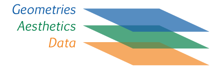
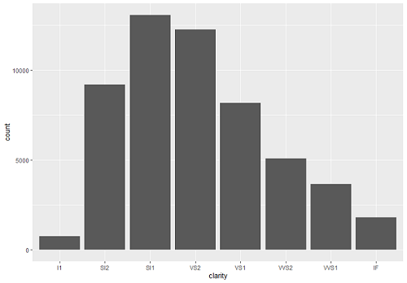

# Ders 4

## Başlıklar:
* [Giriş](#giriş) 
* [ggplot2](#ggplot2) 
* Grafik çeşitleri - Abdullah
* Tek değişkenli grafikler (sürekli)-(continouse variables) - Abdullah
* Tek değişkenli grafikler (kesikli)-(discrete variable) - Abdullah
* İki Değişkenli Grafikler (ikisi sürekli) - Abdullah
* İki Değişkenli Grafikler (biri kesik biri sürekli) - Abdullah
* Grafik ile özet istatistik Belirtme - Abdullah
* [Bar Grafiği ile Oran Gösterme](#BarGrafiğiOranGösterme) - Petek
* [Facetting](#Facetting) - Petek 
* [Koordinat Sistemleri](#KoordinatSistemleri) - Petek
* [Temalar](#Temalar) - Petek
* TED: The best stats you've ever seen | Hans Rosling
* ggplot2 ile Yapılabilecek Diğer Şeyler 
* Case Study 1 (Genel Egzersiz) : mpg veri seti
* Case Study 2: gapminder verisi ile animasyonlu görselleştirme

## Giriş

*Inan hoca: "Geçirdiğimiz üç içerisinde R okur yazarlığını belli bir noktaya getirebilimişsinizdir. Üç hafta içinde çok muhteşem olmak ve yetkin hissetmek mümkün değil tabi ki. Ama en azından okur yazarlığınızı artık geliştirdiğinizi, hatalarınızı bulabildiğinizi, ve yaptıkça daha iyi olacağınızı hissediyorsanız doğru yoldasınız demek. Bundan sonra daha çok veri bilimi prespektifinden bakmaya başlıyor olacağız. Kullandığımız araçların teknik kısmını öğreniyor olacağız ama asıl amacımız bunları farklı durumlarda kullanıp onlardan nasıl bir hikaye çıkarabileceğimizi, nasıl bir değer üretebileceğimizi, ve nasıl bir bilgi ortaya çıkarabileceğimizi görmektir. Bu hafta veri görselleştirmeyi öğreniyor olacağız ve aklınıza bu tür sorular gelebilir: "peki şunu yapabilecek miyim?","peki bu kutuphanede bu özellik ta var mı?" . paketlerin öğrenmenin bir sonu yok, bir çok şey yapabilmek mümkün farklı paketlerle. Biz burada bu aletlerin nasıl kullanıldığını ve yaygın özelliklerini tartışıyor olacağız. Bundan sonra sizin yaratıcılığınıza bırakıp case study üzerine hikaye anlatmaya doğru ilerleyeceğiz."*

Geçen haftalarda veriyi kesip biömeyi, filtrelemeyi, istatistikleri çıkarmayı öğrenmiştik. Şimdi ise kesip biçtiğimiz veriyi karşı tarafa anlayabilecekleri şekilde sunmayı öğreneceğiz. bu süreçte veri görselleştirme büyük bir rol oynar.

## ggplot2
ggplot2 veri görselleştirme konsunda dünyada yaygın kullanınlan bir R paketi. Temelde 3 katmandan oluşur:
1. Data katmanı: bu katmanda kullanmak istediğimiz veri kaynağını beliriyoruz
1. Aesthetics katmanı: bu katmanda veri kayanağından plot etmek istediğimiz değişkenleri belirliyoruz. Üstelik neye göre renklendirelim ve neye göre şeffaflandıralım gibi soruları bu katmanda da belirlenir
1. Geometries katmanı: bu katmanda çizmek istediğimiz gradiği belirliyoruz (nokta grafiği, çizgi grafiği, bar grafizi vs.)


## Bar Grafiği ile Oran Gösterme

Bar grafiği ile elmas veri setimizin belirli kategorilerinde kaçar adet elmas olduğunu gösterebiliyorduk. 
Sıklıkları bar grafiği ile gösterebiliyorduk da diyebiliriz.
Şimdi bu sıklıkların oranlarını bar grafiği ile nasıl gösterebiliriz ona bakalım.

Sıklık oranlarını görmek aslında her kategori için o kategorinin elmasların yüzde kaçını oluşturduğunu görmek demek.

Kategorilerimizi berraklık değişkeni oluştursun, çeşitli berraklıkta elmaslarımız olduğunu biliyoruz. Bunların her birinden kaç tane olduğunu gösteren bar grafiğini çizelim.
```R
ggplot(diamonds)+
  geom_bar(aes(x=clarity))
```
Bu komut bize aşağıdaki grafiği veriyor.


## Facetting
## Koordinat Sistemleri
## Temalar

