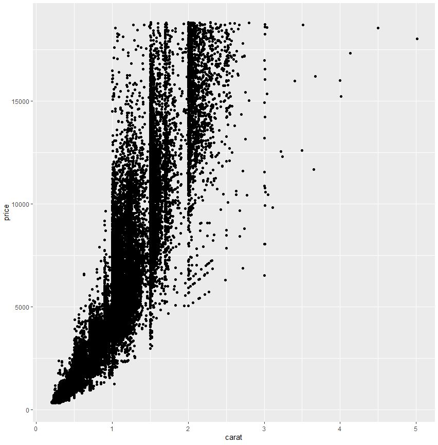
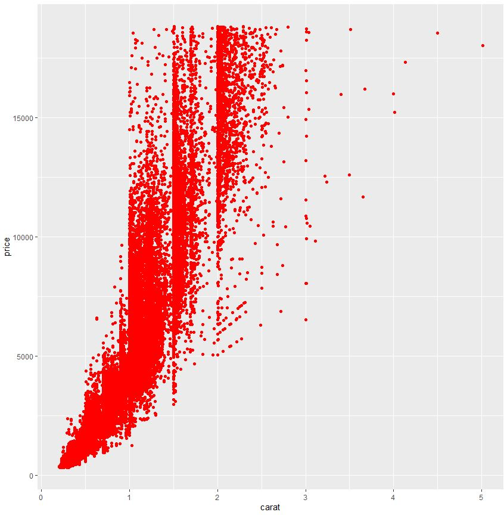
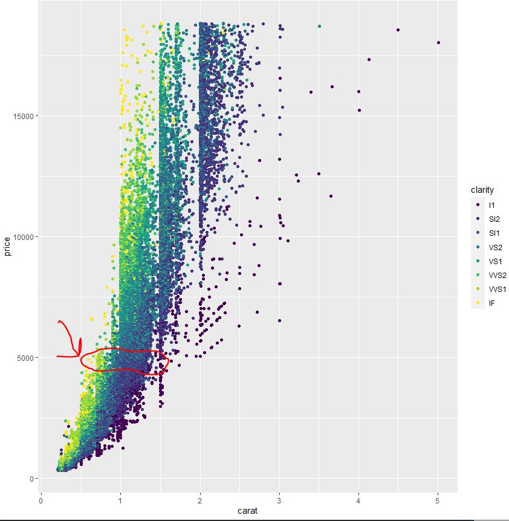
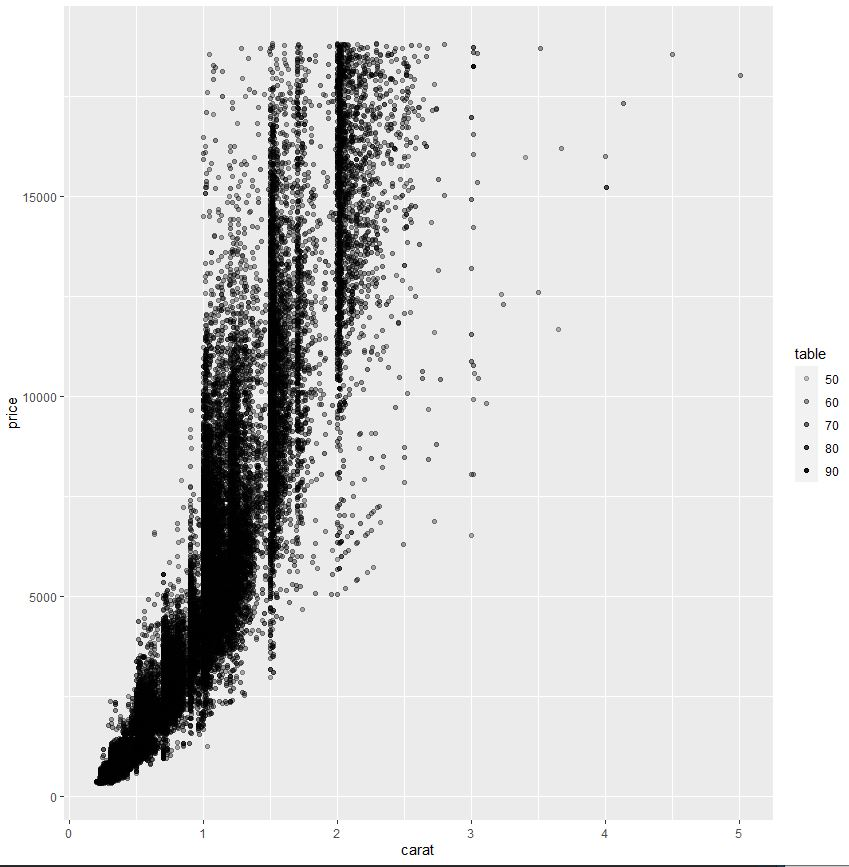
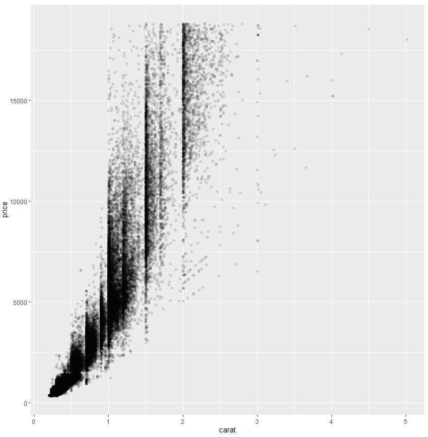
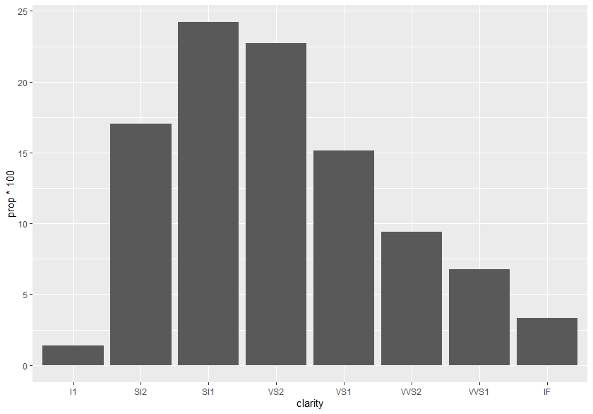
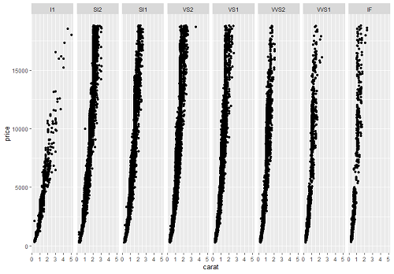
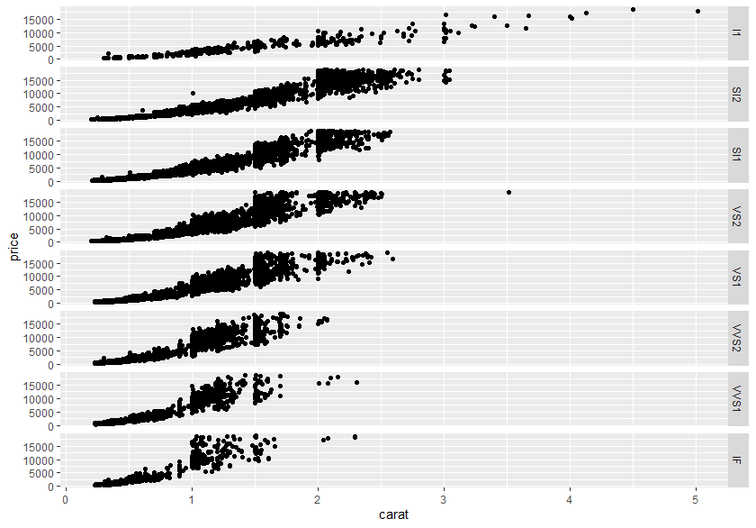
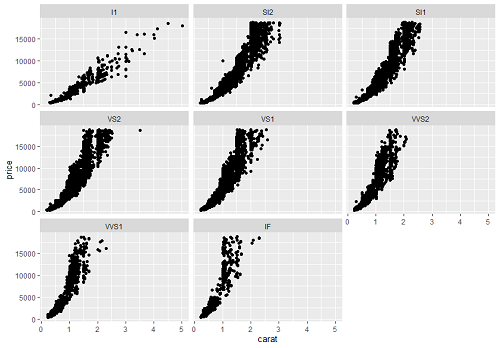

# Ders 4

## Başlıklar:
* [Giriş](#giriş) 
* [ggplot2](#ggplot2) 
* Grafik çeşitleri - Abdullah
* Tek değişkenli grafikler (sürekli)-(continouse variables) - Abdullah
* Tek değişkenli grafikler (kesikli)-(discrete variable) - Abdullah
* İki Değişkenli Grafikler (ikisi sürekli) - Abdullah
* İki Değişkenli Grafikler (biri kesik biri sürekli) 
* Grafik ile özet istatistik Belirtme
* [Bar Grafiği ile Oran Gösterme](#BarGrafiğiOranGösterme) - Petek
* [Facetting](#Facetting) - Petek 
* [Koordinat Sistemleri](#KoordinatSistemleri) - Petek
* [Temalar](#Temalar) - Petek
* TED: The best stats you've ever seen | Hans Rosling
* ggplot2 ile Yapılabilecek Diğer Şeyler 
* Case Study 1 (Genel Egzersiz) : mpg veri seti
* Case Study 2: gapminder verisi ile animasyonlu görselleştirme

## Giriş

*Inan hoca: "Geçirdiğimiz üç içerisinde R okur yazarlığını belli bir noktaya getirebilimişsinizdir. Üç hafta içinde çok muhteşem olmak ve yetkin hissetmek mümkün değil tabi ki. Ama en azından okur yazarlığınızı artık geliştirdiğinizi, hatalarınızı bulabildiğinizi, ve yaptıkça daha iyi olacağınızı hissediyorsanız doğru yoldasınız demek. Bundan sonra daha çok veri bilimi prespektifinden bakmaya başlıyor olacağız. Kullandığımız araçların teknik kısmını öğreniyor olacağız ama asıl amacımız bunları farklı durumlarda kullanıp onlardan nasıl bir hikaye çıkarabileceğimizi, nasıl bir değer üretebileceğimizi, ve nasıl bir bilgi ortaya çıkarabileceğimizi görmektir. Bu hafta veri görselleştirmeyi öğreniyor olacağız ve aklınıza bu tür sorular gelebilir: "peki şunu yapabilecek miyim?","peki bu kutuphanede bu özellik ta var mı?" . paketlerin öğrenmenin bir sonu yok, bir çok şey yapabilmek mümkün farklı paketlerle. Biz burada bu aletlerin nasıl kullanıldığını ve yaygın özelliklerini tartışıyor olacağız. Bundan sonra sizin yaratıcılığınıza bırakıp case study üzerine hikaye anlatmaya doğru ilerleyeceğiz."*

Geçen haftalarda veriyi kesip biömeyi, filtrelemeyi, istatistikleri çıkarmayı öğrenmiştik. Şimdi ise kesip biçtiğimiz veriyi karşı tarafa anlayabilecekleri şekilde sunmayı öğreneceğiz. bu süreçte veri görselleştirme büyük bir rol oynar.

## ggplot2
ggplot2, (grammar of graphics) veri görselleştirme yapmamızı sağlayan bir R paketidir.  Dünyada kullanımı oldukça yaygın ve popüler olan bir görselleştirme paketidir..

ggplot, veri görselleştirmenin bir grameri olarak düşünebiliriz, ilk başta kolay bir cümle kuracağız ve sonra zenginleştirmeye çalışacağız.
```R
#Paketi indirip çağıralım
install.packages("ggplot2")
library(ggplot2)
```
ggplot temelde 3 katmandan oluşur: (aslında 7 katmandan oluşur ama şimdilik ilk üçüne bakacağız. Daha fazla bilgi için [buraya](https://www.youtube.com/watch?v=PiY9hwOkL8U) bakabilirsiniz.)
1. Data katmanı: bu katmanda kullanmak istediğimiz veri kaynağını beliriyoruz
1. Aesthetics katmanı: bu katmanda veri kayanağından plot etmek istediğimiz değişkenleri belirliyoruz. Üstelik neye göre renklendirelim ve neye göre şeffaflandıralım gibi soruları bu katmanda da belirlenir
1. Geometries katmanı: bu katmanda çizmek istediğimiz gradiği belirliyoruz (nokta grafiği, çizgi grafiği, bar grafizi vs.)


Önce veri setimizi tanımlarız (Data) sonra estetikleri(değişkenleri, renkleri, şekilleri) tanımlarız (Aesthetics) sonrasında ise çizdirmek istediğimiz grafiği tanımlarız (Geometries).

Bugün kullanacağımız her bir komutun çokça argümanı var\ o yüzden argümanları okumaya ve internette araştırmaya alışmamız lazım.

 Veri görselleştirmenin bir sınırı yok. Burada ggplot'un temel kullanma mantığını öğreneceğiz ama kalanı sizin yaratıcılığınıza kalır.  

Neler yapılabildiğine dair merak ediyorsanız buraya bakabilirsiniz: https://www.r-graph-gallery.com

ggplot içinde "diamonds" veri setine erişebiliriz, verisetinin bilgilerine ve faklı değişkenlerin anlamlarına *?diamonds* komutuyla bakabiliriz. dıamnds diye bir değişkene atalım ve  yapısını inceleyelim,
```R
diamonds <- diamonds 
str(diamonds)

> tibble [53,940 x 10] (S3: tbl_df/tbl/data.frame)
 $ carat  : num [1:53940] 0.23 0.21 0.23 0.29 0.31 0.24 0.24 0.26 0.22 0.23 ...
 $ cut    : Ord.factor w/ 5 levels "Fair"<"Good"<..: 5 4 2 4 2 3 3 3 1 3 ...
 $ color  : Ord.factor w/ 7 levels "D"<"E"<"F"<"G"<..: 2 2 2 6 7 7 6 5 2 5 ...
 $ clarity: Ord.factor w/ 8 levels "I1"<"SI2"<"SI1"<..: 2 3 5 4 2 6 7 3 4 5 ...
 $ depth  : num [1:53940] 61.5 59.8 56.9 62.4 63.3 62.8 62.3 61.9 65.1 59.4 ...
 $ table  : num [1:53940] 55 61 65 58 58 57 57 55 61 61 ...
 $ price  : int [1:53940] 326 326 327 334 335 336 336 337 337 338 ...
 $ x      : num [1:53940] 3.95 3.89 4.05 4.2 4.34 3.94 3.95 4.07 3.87 4 ...
 $ y      : num [1:53940] 3.98 3.84 4.07 4.23 4.35 3.96 3.98 4.11 3.78 4.05 ...
 $ z      : num [1:53940] 2.43 2.31 2.31 2.63 2.75 2.48 2.47 2.53 2.49 2.39 ...

summary(diamonds)

>      carat               cut        color        clarity          depth           table           price      
 Min.   :0.2000   Fair     : 1610   D: 6775   SI1    :13065   Min.   :43.00   Min.   :43.00   Min.   :  326  
 1st Qu.:0.4000   Good     : 4906   E: 9797   VS2    :12258   1st Qu.:61.00   1st Qu.:56.00   1st Qu.:  950  
 Median :0.7000   Very Good:12082   F: 9542   SI2    : 9194   Median :61.80   Median :57.00   Median : 2401  
 Mean   :0.7979   Premium  :13791   G:11292   VS1    : 8171   Mean   :61.75   Mean   :57.46   Mean   : 3933  
 3rd Qu.:1.0400   Ideal    :21551   H: 8304   VVS2   : 5066   3rd Qu.:62.50   3rd Qu.:59.00   3rd Qu.: 5324  
 Max.   :5.0100                     I: 5422   VVS1   : 3655   Max.   :79.00   Max.   :95.00   Max.   :18823  
                                    J: 2808   (Other): 2531                                                  
       x                y                z         
 Min.   : 0.000   Min.   : 0.000   Min.   : 0.000  
 1st Qu.: 4.710   1st Qu.: 4.720   1st Qu.: 2.910  
 Median : 5.700   Median : 5.710   Median : 3.530  
 Mean   : 5.731   Mean   : 5.735   Mean   : 3.539  
 3rd Qu.: 6.540   3rd Qu.: 6.540   3rd Qu.: 4.040  
 Max.   :10.740   Max.   :58.900   Max.   :31.800  
```

ggplot katmanla çalışan bir paket, ve bir katmanı '+' işareti ile ekleyebilirsiniz. 

```R
ggplot(diamonds, aes(x=carat, y=price))  +
  geom_point() 
```


Gördüğümüz gibi bir nokta gradiği elde edebildik! yaklaşık 54 bin nokta var ve noktaların çoğunu üstüste çizilmiş durumda. Ama genel bir şekilde, carat değeri arttıkça price'ın değerinin arttığıa dair bir gözlem yapabiliriz. Merak etmeyin ilerde bunların istatistiksel analizlerini yapıyor olacağız !

estetikleri geom_point() içinde yazarak ta grafiğimizi elde edebilirdik, 
```R
ggplot(diamonds) + 
  geom_point(aes(x=carat, y=price))
```
Yalnızca ggplot()'un içinde yazdığımız zaman, ardından gelen tüm katmanlar buna göre çizecek. İkinci yöntem ise her bir katmanın ayrı estetiğini belirleyebiliriz. 

Argümanları incelemeyi başlayalım! Eğer grafiği renklendirmek istersek "color" argümanı kullancağız.

```R
ggplot(diamonds) + 
  geom_point(aes(x=carat, y=price), color="red")
```



Eğer grafikle daha çok şey açıklamak istersek noktaları bir değişkene göre renklendirebiliriz. Bunu yaparken ilgilii argümanı aes() fonksiyonu içine yazıyoruz

> **Not: noktalara sabit bir renk vermek istiyorsak aes()'in dışına yazmamız lazım. Belli bir değişkene göre renklendirmek istersek aes()'in içine yazarız.** 

```R
ggplot(diamonds) + 
  geom_point(aes(x=carat,y=price,color=clarity))
```


İyice bakarsak, caratı 1.5 civarında olanların fiyatı 5 bin iken, yine caratı 0.5 olanların fiyatı da 5 bindir. Buna istinaden clarity'nin fiyata bir etkisi var olduğunu düşünebiliriz.

geom_point fonksiyonunun yardım açıklamalarına bakacak olursak bir çok alpha, color, fill, group, shape, size, stroke gibi aesthetics'ler ile grafiğimizi daha açıklayıcı hale getirebiliriz.

> **Egzersiz:** Elmas karatı ile fiyat arasındaki ilişkiye saçılım (point)grafiği ile bakmıştık. Peki bu grafiği alpha argümanını kullanarak elmas genişliği (*table*) değişkeni ile karat ve fiyatları nasıl değiştiğine bakalım.

```R

ggplot(diamonds) + 
  geom_point(aes(x=carat,y=price,alpha=table))

```



Gördüğümüz gibi şeffaflığıa göre grafiğimize table bilgisi ekleyebilirdik. Burada noktalar üst üste bindiği için görmekte zorluk çekiyoruz. Üst üste binen noktaları daha iyi görebilmek için noktalara (*alpha*) argümanı ile şeffaflaştırabiliriz. (0'a yaklaştıkça daha şeffaf olur)

```R
ggplot(diamonds) + 
  geom_point(aes(x=carat,y=price),alpha=0.1)
```



Biraz daha iyi, değil mi ?

## Bar Grafiği ile Oran Gösterme

Bar grafiği ile elmas veri setimizin belirli kategorilerinde kaçar adet elmas olduğunu gösterebiliyorduk. 
Sıklıkları bar grafiği ile gösterebiliyorduk da diyebiliriz.
Şimdi bu sıklıkların oranlarını bar grafiği ile nasıl gösterebiliriz ona bakalım.

Sıklık oranlarını görmek aslında her kategori için o kategorinin elmasların yüzde kaçını oluşturduğunu görmek demek.

Kategorilerimizi berraklık değişkeni oluştursun, çeşitli berraklıkta elmaslarımız olduğunu biliyoruz. Bunların her birinden kaç tane olduğunu gösteren bar grafiğini çizelim.
```R
ggplot(diamonds)+
  geom_bar(aes(x=clarity))
```
Bu komut bize aşağıdaki grafiği veriyor.


Oranları görmek istersek yapmamız gereken y eksenini oranları gösterecek şekilde tanımlamak. 

Bunu aes() fonksiyonundaki y argümanına ..prop.. atayarak yapacağız. ..prop.. R'a oranları göstermesini istediğimizi söylememize yarayan bir anahtar kelime. 

Fakat bir argümanı daha tanımlamamız gerekiyor bu da grup argümanı, eğer bu argümanı sağlamazsak R her bir kategori için bir grup oluşturacak ve oranları bu gruplara göre alacak dolayısıyla bütün oranları 1 olarak göreceğiz. Bizim istediğimiz bütün kategorileri bir grup olarak alması ve her kategorideki elmasları total elmaslara oranlaması, dolayısıyla R'a bir tane grup istediğimizi belirtmemiz gerekiyor.
```R
elmaslar +
  geom_bar(aes(x=clarity, y=..prop.., group=1))
```
Bu komut bize aşağıdaki grafiği veriyor. Y eksenindeki değerlerin değişimini gözlemleyebilirsiniz.


Grafiğimizi daha anlaşılır kılmak için y ekseninde kategorilerin total elmasların yüzde kaçını oluşturduklarını görmek istiyoruz. Y eksenindeki her değeri 100 ile çarparsak istediğimiz grafiği elde edebiliriz.
```R
elmaslar +
  geom_bar(aes(x=clarity, y=..prop..*100, group=1))
```
Bu komut bize aşağıdaki grafiği veriyor. Artık her berraklık kategorisindeki elmas sayılarının total elmasların yüzde kaçını oluşturduklarını net bir şekilde görebiliyoruz.



## Facetting

Facetting başka bir grafik oluşturma yöntemidir. Diyelim verimiz ile ilgili bir grafik çıkardık ve ihtiyacımız olan şey bu grağin farklı özelliklerin kategorileri için özelleşmiş versiyonlarını incelemek. Yani bir özelliğin her bir kategorisi için ayrı grafik çıkarmamız gereken durumlarda kullandığımız bir yöntem.

Örnek verecek olursak, karat ve fiyat arasındaki ilişkiyi incelediğimizi düşünelim ve istiyoruz ki tüm elmaslar için değil de ayrı ayrı her berraklık kategorisi için karat ve fiyat arasındaki ilişkiyi görelim.

Elmaslar veri setimizin berraklık kategorilerine bölünmüş kesitlerini alıp her birinin grafiğini çizmemiz gerekiyor. Fakat neyse ki bunu bizim için yapan bir fonksiyon var, üstelik bu grafikleri aynı görselde buluşturuyor. 

Fonksiyonumuz facet_grid() fonksiyonu, yapmamız gereken tek şey bu fonksiyona istediğimiz özelliği vermek. Bu fonksiyon da çizdiğimiz ilk bütüncül grafiği tek tek bu özelliğin kategorilerine uygulayıp kategori sayısı kadar grafiği karşımıza getirecek.
```R
elmaslar +
  geom_point(aes(x=carat, y=price)) +
  facet_grid(.~clarity)
```


Gördüğünüz üzere berraklık özelliğini argüman olarak facet_grid() fonksiyonuna verdik. Fakat ".~" ne anlama geliyor? 

facet_grid()in kaç tane kategori varsa o kadar grafik verdiğini söylemiştik, bu grafiklerin görselde nasıl görüneceklerini belirlemek için eklediğimiz bir ifade. Grafikler yatay veya dikey görünebilir. Yukarıdaki örnekte dikey şekilde görüyoruz.
```R
elmaslar +
  geom_point(aes(x=carat, y=price)) +
  facet_grid(clarity~.)
```


Bu durumda ise yatay şekilde görüyoruz.

Grafiklerimizi kutucuklara bölünmüş şekilde de görmek isteyebilirdik, bu durumda başka bir facetting fonksiyonu olan facet_wrap() fonksiyonunu kullanıyoruz. Ona da aynı şekilde berraklık argümanını sağlıyoruz.
```R
elmaslar +
  geom_point(aes(x=carat, y=price)) +
  facet_wrap(~clarity)
```


## Koordinat Sistemleri
## Temalar
