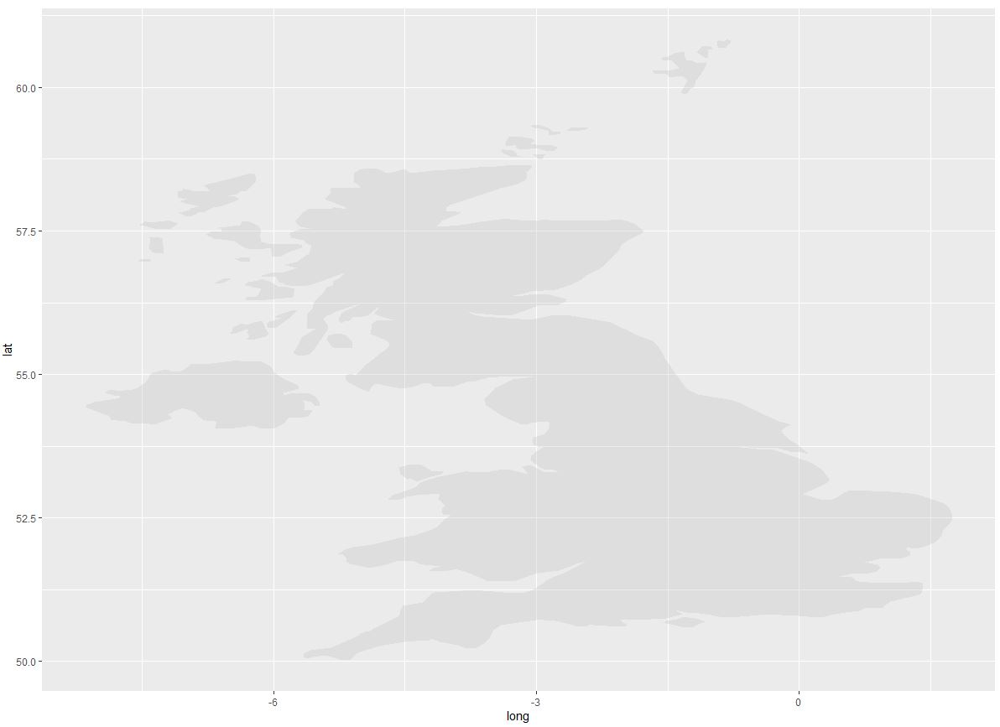
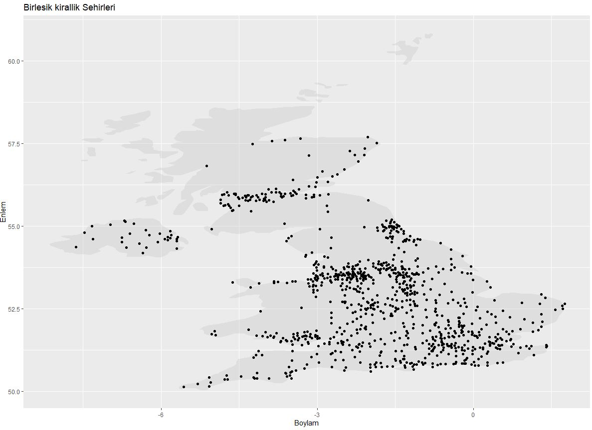
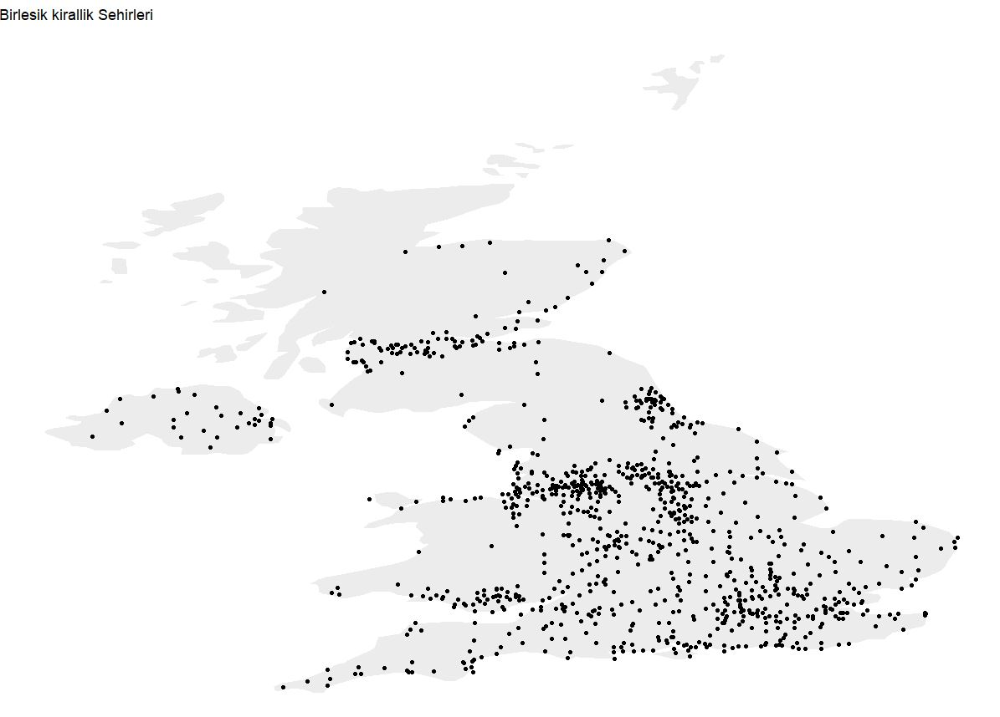
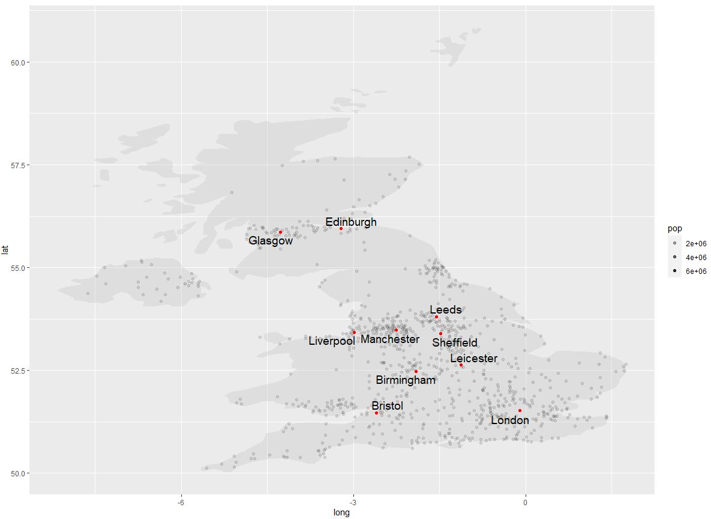
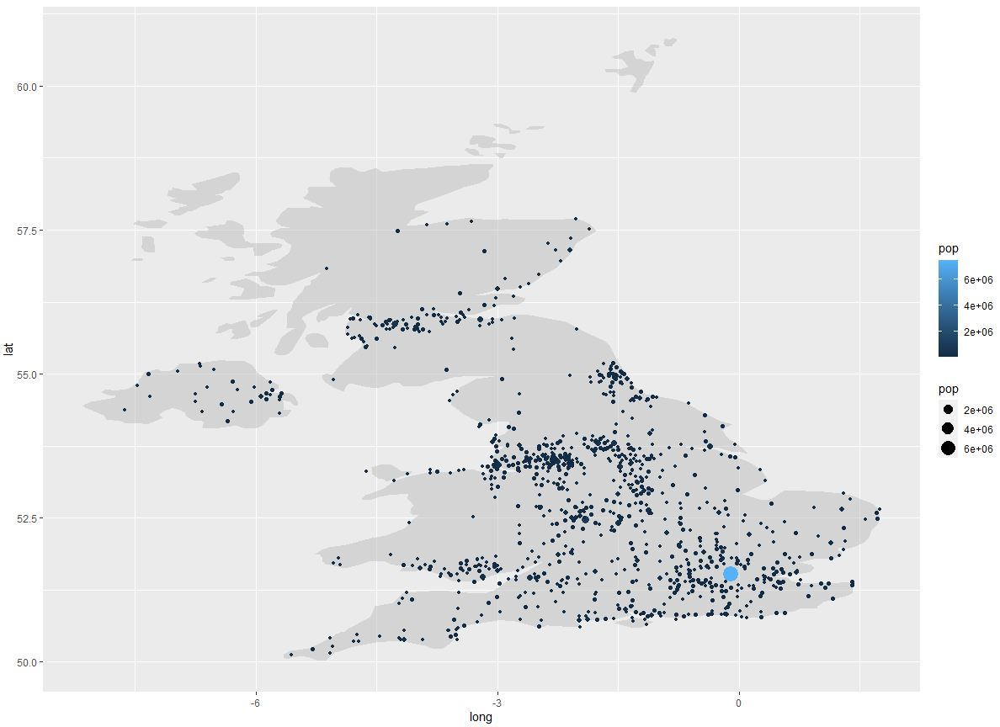
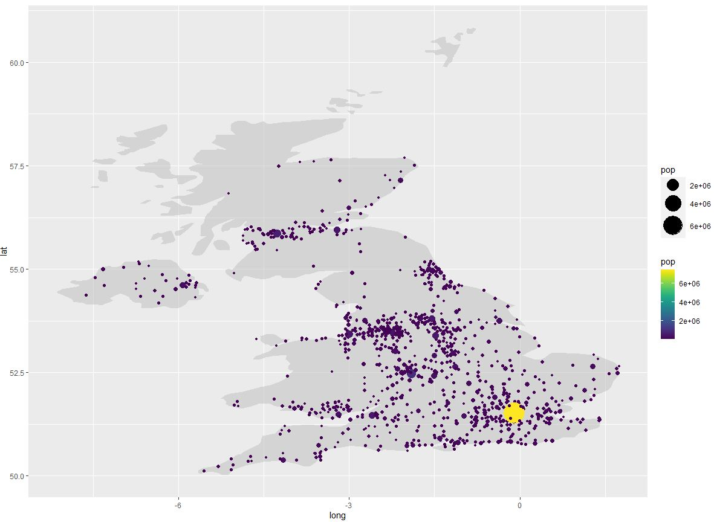
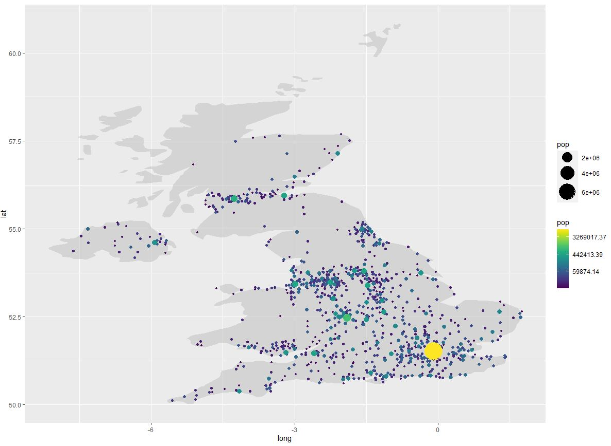

# Ders 5

## Başlıklar

* [Giriş](#giris) - Abdullah
* [ggplot2 ile Haritalandırma](ggplot2-lie-haritalandirma) - Abdullah
* Özelleştirilmiş Baloncuk Haritası (Bubble Map)
* ggplot2 ile Renk Tonlu Harita (Choropleth)
* Shape Formatında Mekansal Veri
* Leaflet
* Kendi ikonumuzu yaratma
* İkonları Bir Değere Göre Değiştirme
* Yuvarlak Şeklinde Marker Ekleme
* Kümeler Oluşturma
* Egzersiz
* Veri Setleri ile Çalışma-Choropleth


## Giriş:
**Mekansal Veri (Spatial Data) nedir ?**

Mekansal veri en basit tanımıyla yeryüzünde coğrafi konum içeren veridir. 

**Coğrafi Bilgi Sistemleri (CBS) nedir ?**

günümüzde konuma dayalı her türlü grafik ve tanımlayıcı bilgiyi entegre ederek kullanıcıya bu mekansal verilerle ilgili bilgi sunar.

Mekansal veriler **Nokta**, **Çizgi**, veya **Çokgen (Poligon)** Şeklinde verileri içerebilir.

**Nokta:** Nokta özelliği gösteren bir elektrik direği tek bir (x, y) koordinatları ile tanımlanır.

**Çizgi:** Çizgi özelliği gösteren bir yol ya da akarsu şeklindeki coğrafik varlık birbirini izleyen bir dizi (x, y) koordinat serisi şeklinde saklanır.

**Poligon:** Poligon özelliğine sahip coğrafik varlıklar, örneğin imar adası, bina, orman alanı parsel veya göl, kapalı şekiller olarak, başlangıç ve bitişinde aynı koordinatlar olan (x, y) dizi koordinatları ile depolanır.

Bu (x, y) koordinatları veri setlerinde karşımıza genelde (boylam, enlem)(longitude, latitude) şeklinde karşımıza çıkacaktır.

Peki bu mekansal verileri nereden elde ediyoruz ve ne tür veriler var?
Bunlara tek tek bakıyor olacağız, ama genelde mekansal veriler aşağıdaki şekillerde bulunur,

* **Shape file:** *.shp* uzantılıdır(internette "*Turkey .shp*" şeklinde aratabilirsiniz). *rgdal* kütüphanesi ile okunur.

* **GeoJSON:** *GeoJson* Internette yaygın bulunur. *rgdl* veya *geojsonio* kütüphaneleri ile okunur.

* **R libraries** *maps*, *oz*, *mapdata* gibi R'dak' kütüphanelerdeki mekansal veriye ulaşabilirsiniz.

* **Google Open Street map** Bizim haritalarımıza arka plan oluşturukan faydalı olabilir. *leaflet* ya da *ggmap* kütüphaneleri ile okunur.

Veriyi okuduktan sonra R içindeki *plot* fonksiyonu, *Ggplot2*, *Ggmap*, veya *leaflet* kütüphaneleri yardımıyla haritalarımızı çizdireceğiz.

Hadi başlayalım! 

## ggplot2 ile haritalandırma

ilk başta verilerimizi elde edelim. *maps* kütüphanesi bir çok ülke ve şehir ile ilgili mekansal veri içeren veri setleri içeriyor. Onu indirelim,
```R
install.packages("maps")
```
şimdi gereken kütüphaneleri çağıralım,
```R
library(ggplot2)
library(dplyr)
library(maps)
```
Verilerimizi *map* kütüphanesinden *ggplot* içindeki *map_data()* fonksiyonu yardımıyla kolayca ülkelerin/bölgelerin poligon verisini data frame şeklinde elde edebilliriz. UK verlerini inceleyeceğiz. O yüzden UK verileri için filtreyeleim ve *UK* isimli değişkenine atayalım.
```R
UK <- map_data("world") %>% filter(region=="UK")
head(UK)

>       long      lat group order region     subregion
1 -1.065576 50.69024   570 40057     UK Isle of Wight
2 -1.149365 50.65571   570 40058     UK Isle of Wight
3 -1.175830 50.61523   570 40059     UK Isle of Wight
4 -1.196094 50.59922   570 40060     UK Isle of Wight
5 -1.251465 50.58882   570 40061     UK Isle of Wight
6 -1.306299 50.58853   570 40062     UK Isle of Wight
```

*maps* kütüphanesinin içindeki world.cities isimli data frame, şehirlerin hem mekansal(nokta) verileri hem de nüfüs verilerine ulaşabiliriz. Ona bir göz atalım,
```R
str(world.cities)
>               name country.etc   pop   lat  long capital
1 'Abasan al-Jadidah   Palestine  5629 31.31 34.34       0
2 'Abasan al-Kabirah   Palestine 18999 31.32 34.35       0
3       'Abdul Hakim    Pakistan 47788 30.55 72.11       0
4 'Abdullah-as-Salam      Kuwait 21817 29.36 47.98       0
5              'Abud   Palestine  2456 32.03 35.07       0
6            'Abwein   Palestine  3434 32.03 35.20       0
```
Yine UK verilerini filtreleyip *data* isimli bir değikene atayalım,
```R
data <- world.cities %>% filter(country.etc == "UK")
head(data)

>                 name country.etc    pop   lat  long capital
1  Abercarn-Newbridge          UK  10146 51.65 -3.14       0
2            Aberdare          UK  33048 51.72 -3.46       0
3            Aberdeen          UK 184031 57.15 -2.10       0
4         Abergavenny          UK  14251 51.83 -3.02       0
5            Abergele          UK  17819 53.28 -3.58       0
6 Aberkenfig-Bryncoch          UK  10111 51.54 -3.60       0
```
ggplot2 kolayca poligon verisini kullanarak haritayı çizdirebilmemizi ve üzerine nokta verisini yazdırmamızı sağlar. 
Yine bildiğimiz şekilde verilerimizi belirliyoruz (data), aestetiklerimizi de belirliyoruz (burada x ve y değişkenlerimiz longitude ve latitude bilgileridir. Üstelik *group* argümanı da belirlememiz lazım, group değişkenine göre polyigonlar çizilecek. *UK* değişkenimiz içindeli *group* değişkenine atayacağız). 

```R
ggplot()+
  geom_polygon(data = UK, aes(x=long, y=lat, group=group ), fill="grey",alpha=0.3)
``` 


Şimdi üzerine noktasal verilerimizi çizdirelim. (grafiklerimizde uygun şekilde x ve y eksenlerini isimlendirmeyi ve grafın başlığını koymayı da unutmalaylım)
```R
ggplot()+
  geom_polygon(data = UK, aes(x=long, y=lat, group=group ), fill="grey",alpha=0.3)+
  geom_point(data= data, aes(x=long, y=lat)) +
  labs(x="Boylam", y="Enlem", title="Birlesik kirallik Sehirleri")
```


arkadaki temayı temizlemek istersek *theme_void()* fonksiyonu ekleyebiliriz.
```R
ggplot()+
  geom_polygon(data = UK, aes(x=long, y=lat, group=group ), fill="grey",alpha=0.3)+
  geom_point(data= data, aes(x=long, y=lat)) +
  labs(x="Boylam", y="Enlem", title="Birlesik kirallik Sehirleri") +
  theme_void()
```



Şimdi 10 büyük şehri farklı renklerde belirleyelim. Şehirlerin isimlerini yazdırmak için **ggrepel** kütüphanesini kullanacağız. Onu indirelim ve çağıralım.
```R
install.packages("ggrepel")
library(ggrepel)
```

Sadece 10 tane şehirlerin isimlerini yazdırmak istediğimiz için farklı bir değişkende (fonksiyonun kullanacağı veri kaynağı) tutalım.
```R
data1 <- data %>% 
  top_n(10, pop)

data1
>         name country.etc     pop   lat  long capital
1  Birmingham          UK  986969 52.48 -1.91       0
2     Bristol          UK  432967 51.46 -2.60       0
3   Edinburgh          UK  438501 55.95 -3.22       0
4     Glasgow          UK  607192 55.87 -4.27       0
5       Leeds          UK  457875 53.81 -1.55       0
6   Leicester          UK  341201 52.64 -1.13       0
7   Liverpool          UK  468584 53.42 -2.99       0
8      London          UK 7489022 51.52 -0.10       1
9  Manchester          UK  395514 53.48 -2.25       0
10  Sheffield          UK  448596 53.39 -1.48       0
```
Şimdi komutumuzu yazalım

```R
#Daha önce yaptığımız gibi polygonları ve şehirlerin noktaları çizdirelim
ggplot() + 
  geom_polygon(data= UK, aes(x=long, y=lat, group= group), fill="grey",alpha=0.3)+
  geom_point(data= data, aes(x=long, y=lat, alpha=pop))+
  #şeihrlerin isimleri için ggrepel kütüphanesinden geom_repel_text fonskiyonununu kullanacağız. yine verimizi (data1), estetiklerimizi, ve bu fonksiyonun özel argümanı olan label'ı (isimleri hangi kolondan alsın?) belirliyoruz
  geom_text_repel(data=data1, aes(x=long,y=lat, label=name), size=5)+
  # üstüne 10 büyük şehirleri kırmızı noktalarla çizdirelim
  geom_point(data= data1, aes(x=long,y=lat), color="red")
```



*data1* i ayrı tanımlamadan bu şekilde de yazabilirdik.
```R
ggplot() +
  geom_polygon(data=UK, aes(x=long, y=lat, group = group), fill="grey", alpha=0.5) +
  geom_point(data=data, aes(x=long, y=lat, alpha=pop)) +
  geom_text_repel(data = data %>% top_n(10,pop), aes(x=long, y=lat, label=name), size=5) +
  geom_point(data=data %>% top_n(10,pop), aes(x=long, lat), color="red")
```

Haritamızla daha çok şey açıklamak istiyoruz. Nüfus yoğunluğuna göre noktaların rengini ve büyüklüğünü ayarlayalım. 
```R
ggplot() +
  geom_polygon(data = UK, aes(x=long, y=lat, group=group), fill="grey", alpha=0.5)+
  geom_point(data=data, aes(x=long, y=lat, size=pop, color=pop))
```


Bu resim için ne diyebiliyoruz ? şehirlerin arasındaki nufüs aryımı yapabiliyor muyuz ? 

gördüğünüz gibi çok açıklayıcı bir resim değildir. Noktaların boyutları arasındaki farkı ayrıt etmek zordur. Bu problem, default olarak kullanılan ölçekten kaynaklıdır. *?scale_size_continuous()* 'ın dokümantasyonuna bakarsak, *range* argümanın 1 ile 6 arasında bir ölçek aldığını görebiliyoruz. Yani noktaların boyutları, 1 ile 6 arasındadır. Bunu 1 ile 12 olarak değiştirelim. 

Üstelik mavi yerine güzel bir renklendirme elde etmek için *viridis* kütüphanesini kullanalım.

```R
ggplot() +
  geom_polygon(data = UK, aes(x=long, y=lat, group=group), fill="grey", alpha=0.5)+
  geom_point(data=data, aes(x=long, y=lat, size=pop, color=pop))+
  scale_size_continuous(range=c(1,12))+
  scale_color_viridis()
```


Biraz daha iyi ama yine çok açıklayıcı değildir. Gördüğümüz gibi noktaların çoğu aynı renkmiş gibi geliyor.

Bu karşınıza çıkacak yaygın bir problemdir.

 Değişkenin aralığı çok büyük ise(burada nufüs değişkeni gibi milyon mertebesinden) küçük ölçekteki farkları görmek zor olurdur. Değişkeniniz 0-100 arasında ise 0.001 ile 0.0001 arasındaki farkı görmek çok zordur. Bunun nedeni renk skalamız çok büyük olmasıdır. 
 
 Bunu çözebilmek için algoritmik transforamsiyon uygulayabiliriz. Bu ölçekliğimizi değiştiryoruz demektir. Örneğin 1 milyon 6 sayısına karşılık gelirken 1 bin 3 sayısına karşılık gelirdir. 1 milyonluk skala ile çalışmak yerine 6 lık skala ile çalışıyoruz gibi oldu. 


```R
ggplot() +
  geom_polygon(data = UK, aes(x=long, y=lat, group=group), fill="grey", alpha=0.5)+
  geom_point(data=data, aes(x=long, y=lat, size=pop, color=pop))+
  scale_size_continuous(range=c(1,12))+
  scale_color_viridis(trans="log")
```


Bunu pratikte çok kullanacağız. Yalnız eksenlerde ve legendlerde logaritmik skalayı kulandığınızı yazmayı unutmayın!

Resimde gördüğümüz gibi büyük noktalar arkada kaldı. Bunu önde görünmesini istiyorsak. Yani eğer nüfusu yoğun olan şehirleri ön plana çıkarmak istiyorsak veri setimizi nüfusa göre sıralamamız yeterli olacaktır.

```R
data %>% 
  arrange(pop) %>% 
  mutate(name=factor(name, levels=unique(name))) %>% 
  ggplot(.) +
  geom_polygon(data = UK, aes(x=long, y=lat, group=group), fill="grey", alpha=0.5)+
  geom_point( aes(x=long, y=lat, size=pop, color=pop))+
  scale_size_continuous(range=c(1,12)) +
  scale_color_viridis(trans="log")
```


## Özelleştirilmiş Baloncuk Haritası (Bubble Map)
