# Ders 6

## Başlıklar
yazılacak 

## Giriş
yazılacak

## Exploratory Data Analysis (Keşifsel Veri Analizi)

Temel olarak, veriyi anlama, verideki paternleri keşfetme, anomalileri tespit etme, hipotezleri oluşturma ve test etme ve istatistiksel özetler ile birlikte görselleştirmeleri yaptığımız Veri Bilimi alanının en önemli konularından biridir.

Kısacası veriyi anlama ve veriden olabildiğince içgörü (anlam) çıkardığımız bir bölümdür.

İteratif bir döngü içerisinde ilerler:
1. Veri hakkında soru üretmek
2. Bu sorulara görselleştirme, özet istatistikler ve modelleme/çıkarımlarla cevaplar arama
3. Bu cevaplarla birlikte soruların tekrar üzerinden geçme veya yeni sorular üretilip veriden olabildiğince anlam çıkartabiliriz.

Gerek veri analitiği gerek makine öğrenmesi yapmadan önce yapılması gereken bir analiz türüdür.

Keşfedici veri analizinde genelde aşağıdaki araç ve teknikler kullanılır
1. Tek değişkenli görselleştirmeler ve özet istatistikler
2. İki değişkenli görselleştirmeler ve özet istatistikler (Bu kısımda ilgilendiğimiz değişken (hedef/target) ve diğer değişkenler arasındaki ilişkiler hakkında yorum yapabiliriz)
3. Çok değişkenli görselleştirmeler
4. Regreson/Lojistik Regresyon

Son olarak ise sorduğumuz sorulara yönelik olarak hipotezlerimizi kurup bunları istatistiksel hipotez testleriyle test edip hipotezlerimiz hakkında yorum yapabiliriz.

## İnsan Kaynakları (Human Resources) Veri Seti

Bu veri setinde IBM çalışanlarına ait genel özellikler ile birlikte, iş ile ilgili çalışanlara yapılan anket sonuçları ve çalışanların menajerlerinin çalışanlar hakkında yaptıkları anket sonuçları yer almaktadır.

Günümüzde şirketler çalışanların işten ayrılmalarıyla ilgili problemlerle karşılaşmaktadır. Çalışanların, işten ayrılma nedenlerine çözümler üreterek, hem yeni çalışan istihdam etme maliyeti hem de çalışan için yapılan eğitim maliyetleri düşürülebilir.

Elimizde 3 tane veri seti var. "*general.csv*" dosyasında çalışanların genel özellikleri, "*employee survery.csv*" dosyasında çalışanlara yapılan anketin bilgileri, "*manager survery.csv*" dosyasında ise Menajerlere çalışanlar hakkında yapılan anket bilgileri.

Veri setlerimizi yükleyip yapısına bakalım,
```R
#Çalışanların Genel Özellikleri
general <- read.csv("datasets/general.csv")

str(general)

>'data.frame':	4410 obs. of  24 variables:
 $ Age                    : int  51 31 32 38 32 46 28 29 31 25 ...
 $ Attrition              : Factor w/ 2 levels "No","Yes": 1 2 1 1 1 1 2 1 1 1 ...
 $ BusinessTravel         : Factor w/ 3 levels "Non-Travel","Travel_Frequently",..: 3 2 2 1 3 3 3 3 3 1 ...
 $ Department             : Factor w/ 3 levels "Human Resources",..: 3 2 2 2 2 2 2 2 2 2 ...
 $ DistanceFromHome       : int  6 10 17 2 10 8 11 18 1 7 ...
 $ Education              : int  2 1 4 5 1 3 2 3 3 4 ...
 $ EducationField         : Factor w/ 6 levels "Human Resources",..: 2 2 5 2 4 2 4 2 2 4 ...
 $ EmployeeCount          : int  1 1 1 1 1 1 1 1 1 1 ...
 $ EmployeeID             : int  1 2 3 4 5 6 7 8 9 10 ...
 $ Gender                 : Factor w/ 2 levels "Female","Male": 1 1 2 2 2 1 2 2 2 1 ...
 $ JobLevel               : int  1 1 4 3 1 4 2 2 3 4 ...
 $ JobRole                : Factor w/ 9 levels "Healthcare Representative",..: 1 7 8 2 8 6 8 8 3 3 ...
 $ MaritalStatus          : Factor w/ 3 levels "Divorced","Married",..: 2 3 2 2 3 2 3 2 2 1 ...
 $ MonthlyIncome          : int  131160 41890 193280 83210 23420 40710 58130 31430 20440 134640 ...
 $ NumCompaniesWorked     : int  1 0 1 3 4 3 2 2 0 1 ...
 $ Over18                 : Factor w/ 1 level "Y": 1 1 1 1 1 1 1 1 1 1 ...
 $ PercentSalaryHike      : int  11 23 15 11 12 13 20 22 21 13 ...
 $ StandardHours          : int  8 8 8 8 8 8 8 8 8 8 ...
 $ StockOptionLevel       : int  0 1 3 3 2 0 1 3 0 1 ...
 $ TotalWorkingYears      : int  1 6 5 13 9 28 5 10 10 6 ...
 $ TrainingTimesLastYear  : int  6 3 2 5 2 5 2 2 2 2 ...
 $ YearsAtCompany         : int  1 5 5 8 6 7 0 0 9 6 ...
 $ YearsSinceLastPromotion: int  0 1 0 7 0 7 0 0 7 1 ...
 $ YearsWithCurrManager   : int  0 4 3 5 4 7 0 0 8 5 ...
```

```R
#Çalışanlara Yapılan Anket
emp_survey <- read.csv("datasets/employee survey.csv")

>'data.frame':	4410 obs. of  4 variables:
 $ EmployeeID             : int  1 2 3 4 5 6 7 8 9 10 ...
 $ EnvironmentSatisfaction: int  3 3 2 4 4 3 1 1 2 2 ...
 $ JobSatisfaction        : int  4 2 2 4 1 2 3 2 4 1 ...
 $ WorkLifeBalance        : int  2 4 1 3 3 2 1 3 3 3 ...
```

```R
#Menajerlere Çalışanlar Hakkında Yapılan Anket
man_survey <- read.csv("datasets/manager survey.csv")

>'data.frame':	4410 obs. of  3 variables:
 $ EmployeeID       : int  1 2 3 4 5 6 7 8 9 10 ...
 $ JobInvolvement   : int  3 2 3 2 3 3 3 3 3 3 ...
 $ PerformanceRating: int  3 4 3 3 3 3 4 4 4 3 ...
```
Veri seterimizi bir tabloda birleştirelim. 
EmployeeID her 3 veri setinde de ortak bir bir değişken. Dolayısıyla bu 3 veri setini bu değişkene göre birleştirebiliriz.
```R
# join işlemleri için dplyr kütüphanesini çağıralım
library(dplyr)

hr <- general %>% 
  left_join(emp_survey, by="EmployeeID") %>% 
  left_join(man_survey, by="EmployeeID")

#Veri Setinin Genel Yapısını İnceleyelim
str(hr)
>'data.frame':	4410 obs. of  29 variables:
 $ Age                    : int  51 31 32 38 32 46 28 29 31 25 ...
 $ Attrition              : Factor w/ 2 levels "No","Yes": 1 2 1 1 1 1 2 1 1 1 ...
 $ BusinessTravel         : Factor w/ 3 levels "Non-Travel","Travel_Frequently",..: 3 2 2 1 3 3 3 3 3 1 ...
 $ Department             : Factor w/ 3 levels "Human Resources",..: 3 2 2 2 2 2 2 2 2 2 ...
 $ DistanceFromHome       : int  6 10 17 2 10 8 11 18 1 7 ...
 $ Education              : int  2 1 4 5 1 3 2 3 3 4 ...
 $ EducationField         : Factor w/ 6 levels "Human Resources",..: 2 2 5 2 4 2 4 2 2 4 ...
 $ EmployeeCount          : int  1 1 1 1 1 1 1 1 1 1 ...
 $ EmployeeID             : int  1 2 3 4 5 6 7 8 9 10 ...
 $ Gender                 : Factor w/ 2 levels "Female","Male": 1 1 2 2 2 1 2 2 2 1 ...
 $ JobLevel               : int  1 1 4 3 1 4 2 2 3 4 ...
 $ JobRole                : Factor w/ 9 levels "Healthcare Representative",..: 1 7 8 2 8 6 8 8 3 3 ...
 $ MaritalStatus          : Factor w/ 3 levels "Divorced","Married",..: 2 3 2 2 3 2 3 2 2 1 ...
 $ MonthlyIncome          : int  131160 41890 193280 83210 23420 40710 58130 31430 20440 134640 ...
 $ NumCompaniesWorked     : int  1 0 1 3 4 3 2 2 0 1 ...
 $ Over18                 : Factor w/ 1 level "Y": 1 1 1 1 1 1 1 1 1 1 ...
 $ PercentSalaryHike      : int  11 23 15 11 12 13 20 22 21 13 ...
 $ StandardHours          : int  8 8 8 8 8 8 8 8 8 8 ...
 $ StockOptionLevel       : int  0 1 3 3 2 0 1 3 0 1 ...
 $ TotalWorkingYears      : int  1 6 5 13 9 28 5 10 10 6 ...
 $ TrainingTimesLastYear  : int  6 3 2 5 2 5 2 2 2 2 ...
 $ YearsAtCompany         : int  1 5 5 8 6 7 0 0 9 6 ...
 $ YearsSinceLastPromotion: int  0 1 0 7 0 7 0 0 7 1 ...
 $ YearsWithCurrManager   : int  0 4 3 5 4 7 0 0 8 5 ...
 $ EnvironmentSatisfaction: int  3 3 2 4 4 3 1 1 2 2 ...
 $ JobSatisfaction        : int  4 2 2 4 1 2 3 2 4 1 ...
 $ WorkLifeBalance        : int  2 4 1 3 3 2 1 3 3 3 ...
 $ JobInvolvement         : int  3 2 3 2 3 3 3 3 3 3 ...
 $ PerformanceRating      : int  3 4 3 3 3 3 4 4 4 3 ...
```
Şimdi bir özetine biraz detaylıca bakalım,
```R
summary(hr)
>      Age        Attrition            BusinessTravel                  Department   DistanceFromHome   Education    
 Min.   :18.00   No :3699   Non-Travel       : 450   Human Resources       : 189   Min.   : 1.000   Min.   :1.000  
 1st Qu.:30.00   Yes: 711   Travel_Frequently: 831   Research & Development:2883   1st Qu.: 2.000   1st Qu.:2.000  
 Median :36.00              Travel_Rarely    :3129   Sales                 :1338   Median : 7.000   Median :3.000  
 Mean   :36.92                                                                     Mean   : 9.193   Mean   :2.913  
 3rd Qu.:43.00                                                                     3rd Qu.:14.000   3rd Qu.:4.000  
 Max.   :60.00                                                                     Max.   :29.000   Max.   :5.000  

           EducationField EmployeeCount   EmployeeID      Gender        JobLevel                          JobRole   
 Human Resources :  81   Min.   :1     Min.   :   1   Female:1764   Min.   :1.000   Sales Executive          :978  
 Life Sciences   :1818   1st Qu.:1     1st Qu.:1103   Male  :2646   1st Qu.:1.000   Research Scientist       :876  
 Marketing       : 477   Median :1     Median :2206                 Median :2.000   Laboratory Technician    :777  
 Medical         :1392   Mean   :1     Mean   :2206                 Mean   :2.064   Manufacturing Director   :435  
 Other           : 246   3rd Qu.:1     3rd Qu.:3308                 3rd Qu.:3.000   Healthcare Representative:393  
 Technical Degree: 396   Max.   :1     Max.   :4410                 Max.   :5.000   Manager                  :306  
                                                                                    (Other)                  :645  

                                                                                      MaritalStatus  MonthlyIncome    NumCompaniesWorked Over18   PercentSalaryHike StandardHours StockOptionLevel
 Divorced: 981   Min.   : 10090   Min.   :0.000      Y:4410   Min.   :11.00     Min.   :8     Min.   :0.0000  
 Married :2019   1st Qu.: 29110   1st Qu.:1.000               1st Qu.:12.00     1st Qu.:8     1st Qu.:0.0000  
 Single  :1410   Median : 49190   Median :2.000               Median :14.00     Median :8     Median :1.0000  
                 Mean   : 65029   Mean   :2.695               Mean   :15.21     Mean   :8     Mean   :0.7939  
                 3rd Qu.: 83800   3rd Qu.:4.000               3rd Qu.:18.00     3rd Qu.:8     3rd Qu.:1.0000  
                 Max.   :199990   Max.   :9.000               Max.   :25.00     Max.   :8     Max.   :3.0000  

                  TotalWorkingYears TrainingTimesLastYear YearsAtCompany   YearsSinceLastPromotion YearsWithCurrManager EnvironmentSatisfaction
 Min.   : 0.00     Min.   :0.000         Min.   : 0.000   Min.   : 0.000          Min.   : 0.000       Min.   :1.000          
 1st Qu.: 6.00     1st Qu.:2.000         1st Qu.: 3.000   1st Qu.: 0.000          1st Qu.: 2.000       1st Qu.:2.000          
 Median :10.00     Median :3.000         Median : 5.000   Median : 1.000          Median : 3.000       Median :3.000          
 Mean   :11.28     Mean   :2.799         Mean   : 7.008   Mean   : 2.188          Mean   : 4.123       Mean   :2.724          
 3rd Qu.:15.00     3rd Qu.:3.000         3rd Qu.: 9.000   3rd Qu.: 3.000          3rd Qu.: 7.000       3rd Qu.:4.000          
 Max.   :40.00     Max.   :6.000         Max.   :40.000   Max.   :15.000          Max.   :17.000       Max.   :4.000          
 NA's   :9                                                                                             NA's   :25           

  JobSatisfaction WorkLifeBalance JobInvolvement PerformanceRating
 Min.   :1.000   Min.   :1.000   Min.   :1.00   Min.   :3.000    
 1st Qu.:2.000   1st Qu.:2.000   1st Qu.:2.00   1st Qu.:3.000    
 Median :3.000   Median :3.000   Median :3.00   Median :3.000    
 Mean   :2.728   Mean   :2.761   Mean   :2.73   Mean   :3.154    
 3rd Qu.:4.000   3rd Qu.:3.000   3rd Qu.:3.00   3rd Qu.:3.000    
 Max.   :4.000   Max.   :4.000   Max.   :4.00   Max.   :4.000    
 NA's   :20      NA's   :38 
```

Veri seti özetine baktığımızda "Over18" değişkeni, bütün gözlemlerin 18 üstü olduğunu söylüyor. Yani bu verisetimizde bulunsa da bulunmasa da hiç bir etkisi yoktur. 
"StandardHours" ve "EmployeeCount" değişkenlerinde de herhangi bir değişkenlik göremiyoruz dolayısıyla bu değişkenleri veri setimizden çıkartabiliriz.

```R
hr[,c("Over18","StandardHours","EmployeeCount")] <- NULL
```

Şimdi kayıp veri olup olmadığıa bakalım,
```R
sum(is.na(hr))
> 111
```
Veri setimizde 111 tane kayıp (NA) verisi olduğunu sölüyor. Peki bu kayıb veriler hangi kolonda bulunmaktadır?
dyplr içindeki summarise_all() fonksiyonu yardımı ile bulabiliriz. 

```R
hr %>% 
  summarise_all(funs(sum(is.na(.))))

>  Age Attrition BusinessTravel Department DistanceFromHome Education
   0         0              0          0                0         0
  EducationField EmployeeCount EmployeeID Gender JobLevel JobRole
              0             0          0      0        0       0
  MaritalStatus MonthlyIncome NumCompaniesWorked Over18
             0             0                 19      0
  PercentSalaryHike StandardHours StockOptionLevel TotalWorkingYears
                 0             0                0                 9
  TrainingTimesLastYear YearsAtCompany YearsSinceLastPromotion
                     0              0                       0
  YearsWithCurrManager EnvironmentSatisfaction JobSatisfaction
                    0                      25              20
  WorkLifeBalance JobInvolvement PerformanceRating
              38              0                 0
```
Bunu kendi yazdığımız fonksiyonu ile de bulabilirz.
```R
my_func <- function(x){
  return(sum(is.na(x)))
}

sapply(hr, my_func)

>                    Age               Attrition 
                      0                       0 
         BusinessTravel              Department 
                      0                       0 
       DistanceFromHome               Education 
                      0                       0 
         EducationField           EmployeeCount 
                      0                       0 
             EmployeeID                  Gender 
                      0                       0 
               JobLevel                 JobRole 
                      0                       0 
          MaritalStatus           MonthlyIncome 
                      0                       0 
     NumCompaniesWorked                  Over18 
                     19                       0 
      PercentSalaryHike           StandardHours 
                      0                       0 
       StockOptionLevel       TotalWorkingYears 
                      0                       9 
  TrainingTimesLastYear          YearsAtCompany 
                      0                       0 
YearsSinceLastPromotion    YearsWithCurrManager 
                      0                       0 
EnvironmentSatisfaction         JobSatisfaction 
                     25                      20 
        WorkLifeBalance          JobInvolvement 
                     38                       0 
      PerformanceRating 
                      0 
```
> **Soru: Hazır bir yöntem varkan neden kendi fonksiyonumuzu yazmak isteriz?**
Cevap: Kendi fonksiyonum ile daha dinamik bir iş yapabiliyoruz. Diyelim ki çıktıyı bu sekilde olmasını istemedik. Kendi istediğimiz çıktıyı fonksiyonun içinde belirleyebiliriz.

Çalışma ortamı hakkında cevap vermeyenlerden kaç kişi işi bırakmış?
```R
hr %>% 
  filter(is.na(EnvironmentSatisfaction)) %>% 
  count(Attrition)
>  Attrition     n
  <fct>     <int>
1 No           20
2 Yes           5
```

Peki bu 5 kişinin özellikleri nelerdir?
```R
hr %>% 
  filter(is.na(EnvironmentSatisfaction), Attrition=="Yes") %>% 
  summary()

>       Age     Attrition           BusinessTravel
 Min.   :21   No :0     Non-Travel       :0     
 1st Qu.:26   Yes:5     Travel_Frequently:1     
 Median :28             Travel_Rarely    :4     
 Mean   :29                                     
 3rd Qu.:35                                     
 Max.   :35                                     
                                                
                  Department DistanceFromHome   Education  
 Human Resources       :0    Min.   : 1.0     Min.   :1.0  
 Research & Development:5    1st Qu.: 2.0     1st Qu.:2.0  
 Sales                 :0    Median : 9.0     Median :3.0  
                             Mean   : 6.4     Mean   :2.4  
                             3rd Qu.: 9.0     3rd Qu.:3.0  
                             Max.   :11.0     Max.   :3.0  
                                                           
          EducationField EmployeeCount   EmployeeID      Gender 
 Human Resources :0      Min.   :1     Min.   : 196   Female:1  
 Life Sciences   :3      1st Qu.:1     1st Qu.: 406   Male  :4  
 Marketing       :0      Median :1     Median : 910             
 Medical         :2      Mean   :1     Mean   :1074             
 Other           :0      3rd Qu.:1     3rd Qu.:1477             
 Technical Degree:0      Max.   :1     Max.   :2380             
                                                                
    JobLevel                      JobRole   MaritalStatus
 Min.   :2   Manager                  :2   Divorced:3    
 1st Qu.:2   Sales Executive          :2   Married :0    
 Median :2   Laboratory Technician    :1   Single  :2    
 Mean   :2   Healthcare Representative:0                 
 3rd Qu.:2   Human Resources          :0                 
 Max.   :2   Manufacturing Director   :0                 
             (Other)                  :0                 
 MonthlyIncome    NumCompaniesWorked Over18 PercentSalaryHike
 Min.   : 58130   Min.   :0          Y:5    Min.   :12.0     
 1st Qu.: 59930   1st Qu.:1                 1st Qu.:12.0     
 Median :104000   Median :2                 Median :12.0     
 Mean   :114008   Mean   :3                 Mean   :13.8     
 3rd Qu.:173990   3rd Qu.:6                 3rd Qu.:13.0     
 Max.   :173990   Max.   :6                 Max.   :20.0     
                                                             
 StandardHours StockOptionLevel TotalWorkingYears
 Min.   :8     Min.   :0.0      Min.   :1.0      
 1st Qu.:8     1st Qu.:0.0      1st Qu.:5.0      
 Median :8     Median :0.0      Median :7.0      
 Mean   :8     Mean   :0.4      Mean   :5.6      
 3rd Qu.:8     3rd Qu.:1.0      3rd Qu.:7.0      
 Max.   :8     Max.   :1.0      Max.   :8.0      
                                                 
 TrainingTimesLastYear YearsAtCompany YearsSinceLastPromotion
 Min.   :2.0           Min.   :0.0    Min.   :0              
 1st Qu.:2.0           1st Qu.:1.0    1st Qu.:0              
 Median :3.0           Median :2.0    Median :1              
 Mean   :2.6           Mean   :2.4    Mean   :1              
 3rd Qu.:3.0           3rd Qu.:2.0    3rd Qu.:2              
 Max.   :3.0           Max.   :7.0    Max.   :2              
                                                             
 YearsWithCurrManager EnvironmentSatisfaction JobSatisfaction
 Min.   :0.0          Min.   : NA             Min.   :3.0    
 1st Qu.:0.0          1st Qu.: NA             1st Qu.:3.0    
 Median :0.0          Median : NA             Median :4.0    
 Mean   :0.8          Mean   :NaN             Mean   :3.6    
 3rd Qu.:2.0          3rd Qu.: NA             3rd Qu.:4.0    
 Max.   :2.0          Max.   : NA             Max.   :4.0    
                      NA s   :5                              
 WorkLifeBalance JobInvolvement PerformanceRating
 Min.   :1.0     Min.   :1.0    Min.   :3.0      
 1st Qu.:2.0     1st Qu.:1.0    1st Qu.:3.0      
 Median :2.0     Median :3.0    Median :3.0      
 Mean   :1.8     Mean   :2.2    Mean   :3.2      
 3rd Qu.:2.0     3rd Qu.:3.0    3rd Qu.:3.0      
 Max.   :2.0     Max.   :3.0    Max.   :4.0      
```
5 kişi olduğu için genelleme yapamayız ama özelliklere detaylıca bakarsak aklımıza bir sürü soru gelebilir. Onları araştırabiliriz. (Örneğin: Age değişkeni için maksimum değer 35. yaş işten ayrılmanın bir etkeni olabilir mi ?.  Departmnt değişkeni için 5 kişi R&D departmandanmış. Neden acaba?. Gender değişkeni için 4 erkek  1 kadın görüyoruz. cinsiyet bir etken olabilir midir?).

Kategorik ve sürekli değikenleri analiz ederken faklı yaklaşıyoruz. Kategorik değikenler ile başlayalım

## Kategorik Değişkenler ile Keşifsel Veri Analizi

Analizleri soru sormakla başlarız. Acaba IBM çalışanlarından kaç kişi işi bıraktı?
```R
table(hr$Attrition)

>  No  Yes 
3699  711 
```

Peki oran olarak işi bırakma yüzdesi kaçtır? 
```R
table(hr$Attrition)/nrow(hr)*100
>      No      Yes 
83.87755 16.12245 
```

Bunu görselleştirmek için pasta grafiği kullanalım. Burada ggplot kütüphanesini kullanmayacağız. Keşifsel veri analizi yaparkan süslü grafları yapmaya gerek yok . hız önemli bir etkendir. O yüzden base R içinde bulunan *pie()* fonksiyonu kullanacağız
```R
mytable <- table(hr$Attrition)/nrow(hr)*100

pie(mytable, labels=paste(names(mytable), "\n", round(mytable,2), "%"), main="İşi bırakma Oranı")
```
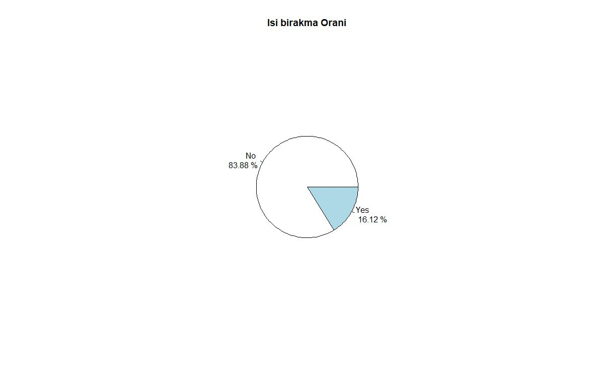

>**Egzersiz:** IBM çalışanlarının cinsiyet dağılımı nedir? Oransal olarak ister pasta ister bar grafiği ile görselleştirelim.
```R
cinsiyet <- table(hr$Gender)/nrow(hr)*100
pie(cinsiyet, labels=paste(names(cinsiyet), "\n", round(cinsiyet), "%"), main="Cinsiyet dagilimi")
```
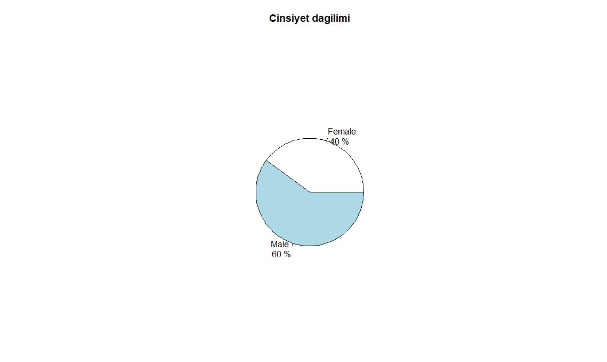

Bu aklımızda bir soru uyandırdı. Acaba bu şirkette erkekler mi kadınlar mı daha çok işten ayırlımaya meyilli ? Başka deyişle, cinsiyet bakımından iş bırakma oranları nedir?
```R
table(hr$Attrition, hr$Gender)

>      Female Male
  No    1494 2205
  Yes    270  441
```
Bunu görselleştirelim
```R
library(ggplot2)
ggplot(hr)+
  geom_bar(aes(x=Gender, fill=Attrition))
```
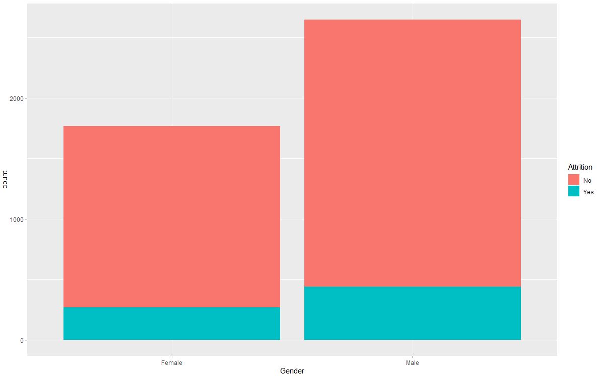

Burada erkeklerin kadınlardan daha fazla işi bırakıyor diyebilir miyiz?
Hayır. Bu resimden net bir çıkarım yapamayız. Oranlara bakmamız lazım.
```R
ggplot(hr)+
  geom_bar(aes(x=Gender, fill=Attrition), position = "fill")
```
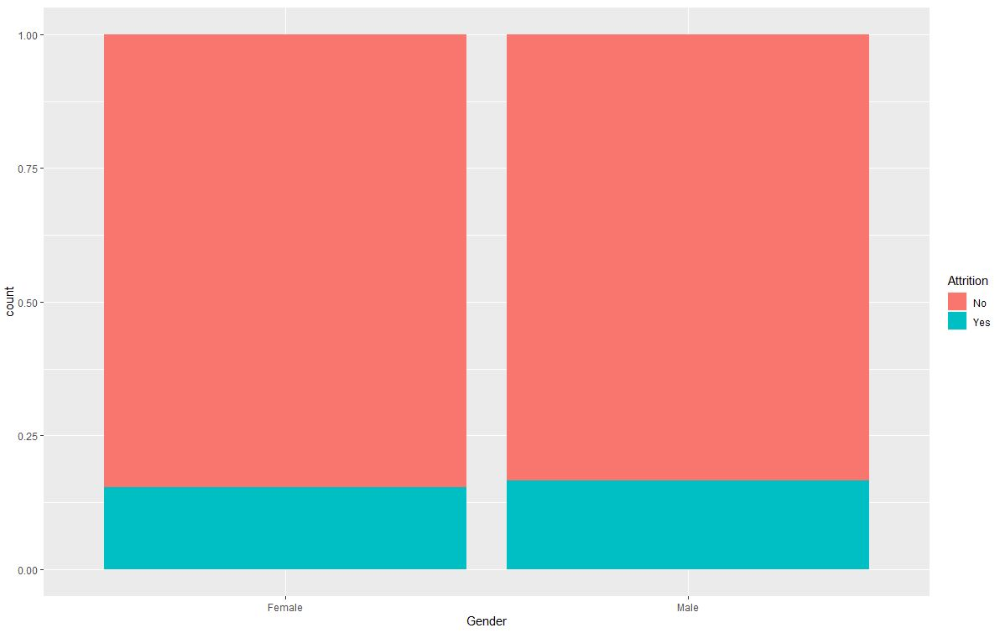

Gördüğümüz gibi, neredeyse hiç bir fark yok.

Bunu farklı şekilde de gösterebilirdik.
```R
hr <- hr %>% 
  mutate(AttritionRate = case_when(Attrition == "Yes" ~ 1,
                                   Attrition == "No" ~ 0))

hr %>% 
  group_by(Gender) %>% 
  summarise(Cinsiyet_oran = mean(AttritionRate)) %>% 
  ggplot(.) + 
  geom_col(aes(x=Gender, y= Cinsiyet_oran, fill=Gender))                  
```
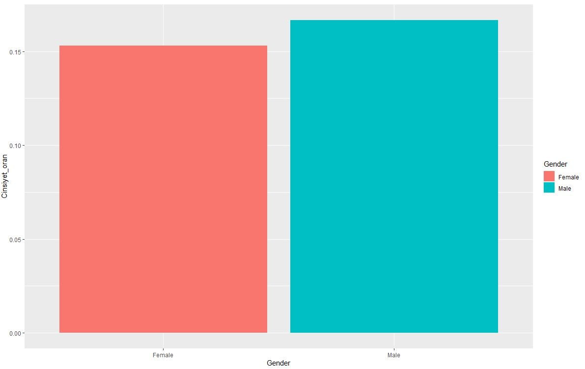

Daha açıklayıcı bir resim elde etmeye çalışalım
```R
hr %>% 
  group_by(Gender) %>% 
  count(Attrition) %>% 
  mutate(prop = n/sum(n)) %>% 
  ggplot(.) +
  geom_col(aes(x=Gender, y=prop, fill=Attrition), position="dodge") +
  geom_text(aes(x=Gender, y=prop, fill=Attrition, label=round(prop,2)), position=position_dodge(width=0.9), vjust=-0.5)
```
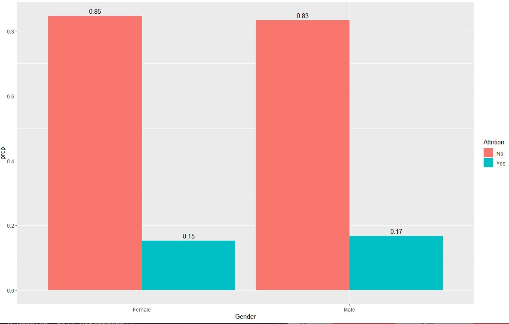

> **Egzersiz:** En çok ve en az çalışanı olan departmanlar hangileridir Departmanlardaki iş bırakma oranları nedir? Grafikleyelim. 

```R
#Departmanlardaki çalışan dağılımı
ggplot(hr) + 
  geom_bar(aes(x=Department))
```
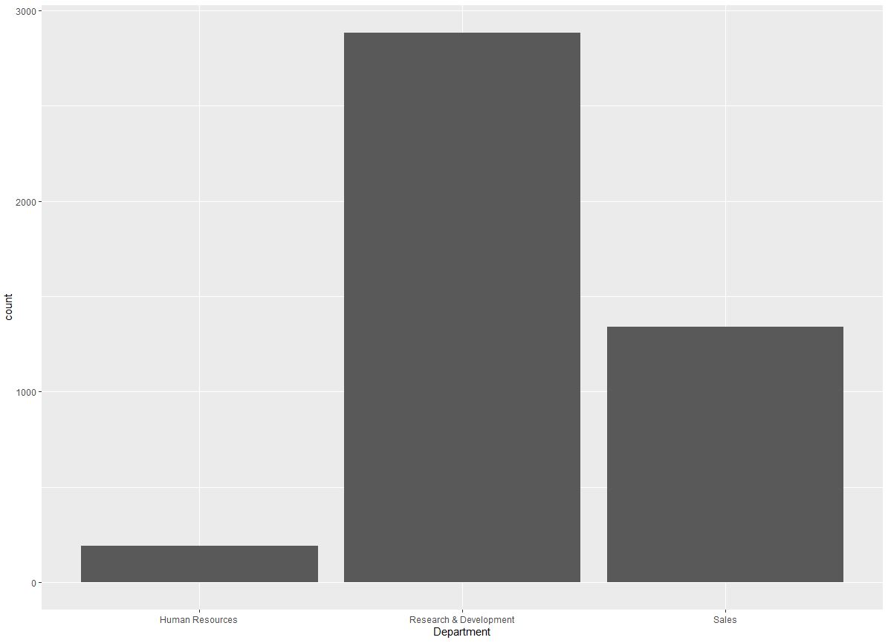

```R
#Departmanlardaki iş bırakma oranları
hr %>% 
  group_by(Department) %>% 
  summarise(Oranlar = mean(AttritionRate)) %>% 
  ggplot(.)+
  geom_col(aes(x=Department, y=Oranlar, fill=Department))
```
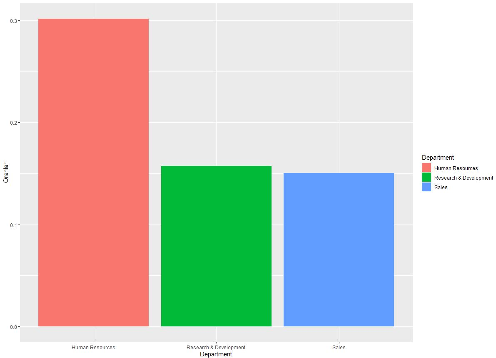

İnsan kaynakları departmanında işten ayrılan kişi sayısı çok daha fazladır!

Departmanlardaki hem çalışan hem de ayrılan kişilerin sıklıklarına bakalım.
```R
ggplot(hr) + 
  geom_bar(aes(x=Department, fill = Attrition))
```
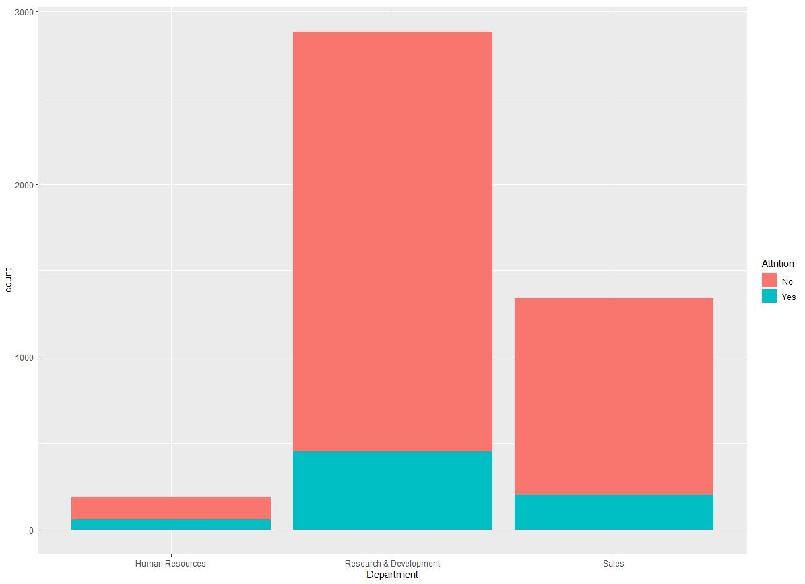

İyi bakarsak Human resources deprtmandaki ayrılan kişi sayısı çalışan kişi sayısından daha fazla gibi gözüküyor (çok net değil). 

Sıklık grafları çok açıklayıcı değil ve bazen yanlış sorulara yol açıyor( örneğin; ortadaki grafa bakarsak kişi sayısı arttıkıça ayrılan kişi sayısı artıyor gibi gelebilir).

Oran graflarına bakmak daha iyi bir alışkanlıktır.

```R
ggplot(hr) + 
  geom_bar(aes(x=Department, fill = Attrition), position="fill")
```
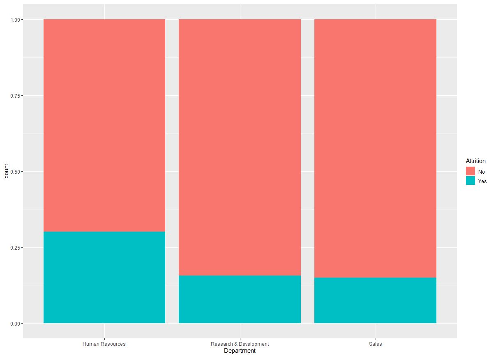

Peki bu departmanlarda cinsiyet bakımından nasıl bir farklılık var ?
```R
ggplot(hr)+
  geom_bar(aes(x=Department, fill = Attrition), position="fill")+
  facet_wrap(~Gender)
```
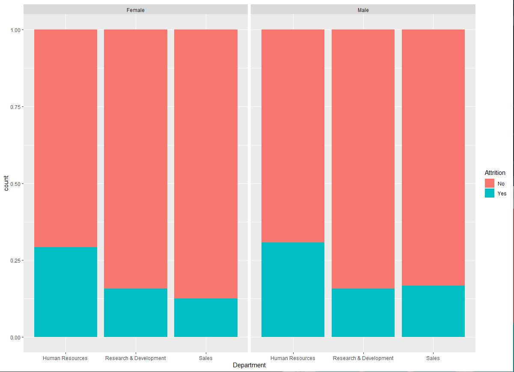

Yine burada cinsiyete göre göz çarpan bir fark olmadığını görüyoruz. Peki JobRole bakımından nasıl ?

```R
ggplot(hr)+
  geom_bar(aes(x=Department, fill = Attrition), position="fill")+
  facet_wrap(~JobRole)
```
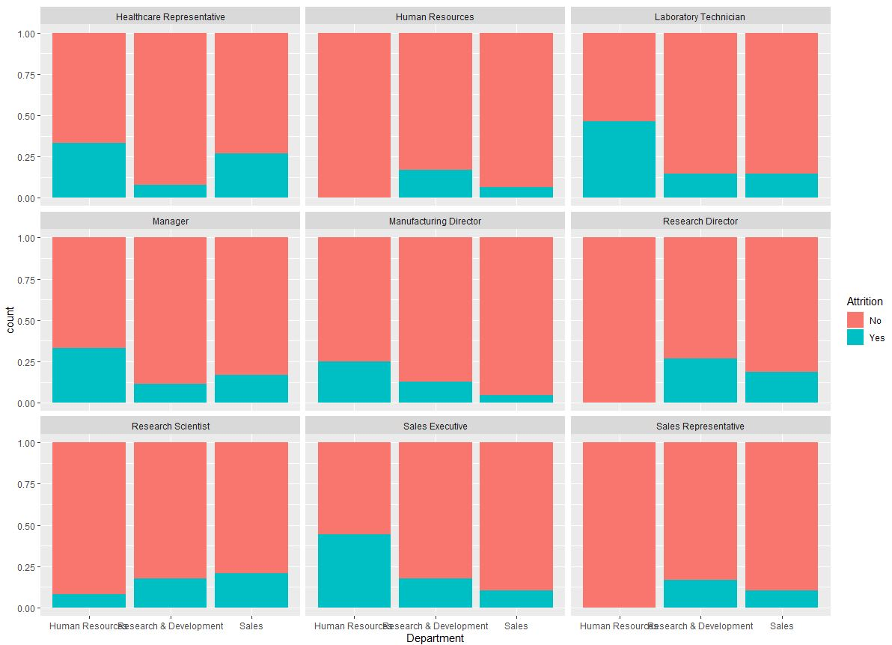

Burada en çok Human resources departmanında çalışan, JobRole'u Laboratory Technician ve  Sales Executive olan kişiler en çok işten ayrıldığını görüyorüz.

Burada oranlarla çalışıyoruz. Oranlarla çalışmanın bir olumsuz yanı var o da gerçek sayırların küçük olduğu durumdadır. burada çalışanların %50 ayrılmış gibi gözükse de 6 kişiden 2 kişi ayrılmış olabilir. Yine durum öyle ise çok şey ifade etmez bize.

Analizimize devam edelim ve Seyahat tipine göre iş bırakma oranları nedir onu bulalım.
```R
ggplot(hr)+
  geom_bar(aes(x=BusinessTravel, fill=Attrition), position="fill")  
```
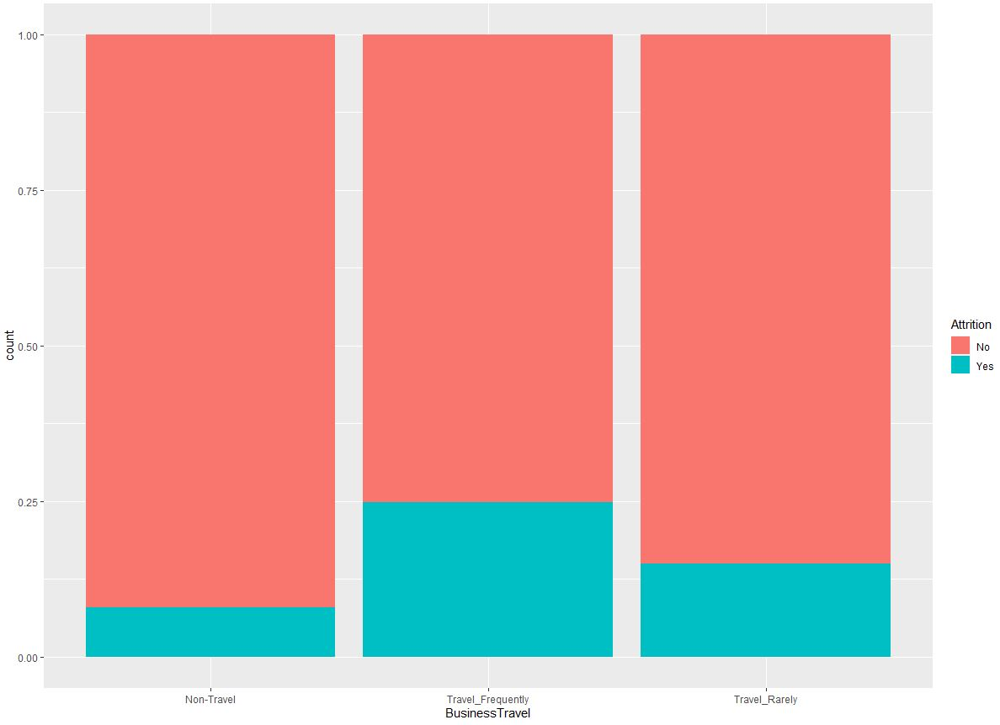

Beklenildiği gibi sıklıkla seyahat eden çalışanlar daha çok işi bırakıyor.
Ama oranlarla çalışırken küçük sayılara karşı dikkatli davranmamız lazım. İstatiksel işlemlerde küçük sayılarla çalışmak çok sevdiğimiz bir şey değil!. 

Daha çok katgorik değişkenler var. Merak ettiğiniz soruları siz araştırabilirsiniz!.


## Numerik Verilerle Keşifsel Veri Analizi

